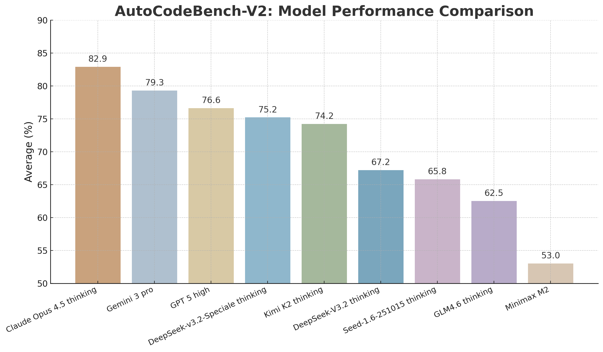

# AutoCodeBench-V2

We released **AutoCodeBench-V2** benchmark, built on the original dataset and iteratively refined through top proprietary models and a sandbox to produce **1,000 higher-quality problems**.

Additionally, we have updated the sandbox with improved performance and fixed several bugs in programming language parsing.

## Leaderboard

<div align="center">
  
</div>

## Quick Start

Below is a complete workflow for evaluation using AutoCodeBench-V2.

### Step 0: Get the Dataset

Download the dataset from Hugging Face:

🔗 [autocodebench-v2.jsonl](https://huggingface.co/datasets/tencent/AutoCodeBenchmark/blob/main/autocodebench-v2.jsonl)

### Step 1: Get Model Outputs

Obtain model outputs and replace the `output` field in `autocodebench-v2.jsonl`.

> **Note:** You must use the following system prompt:
> 
> `You are an expert programmer. Your task is to provide a code solution within a single Markdown code block for the given programming problem. Do not include any direct execution commands, test cases, or usage examples within the code block.`

### Step 2: Start the Sandbox

Pull the V2 sandbox image:

```bash
docker pull hunyuansandbox/multi-language-sandbox:v2
```

Start the sandbox service:

```bash
docker run -d \
  --name sandbox-service \
  -p 8080:8080 \
  --cap-add=NET_ADMIN \
  hunyuansandbox/multi-language-sandbox:v2
```

Verify the service is running:

```bash
# Check container status
docker ps | grep sandbox

# Test service health
curl -X POST http://localhost:8080/submit \
  -H "Content-Type: application/json" \
  -d '{"src_uid": "test-001", "lang": "python", "source_code": "print(\"Hello World\")"}'
```

If the response contains `"exec_outcome": "PASSED"`, the service is running successfully.

### Step 3: Verify Answers

Run the verification script:

```bash
cd AutoCodeBench-V2

python3 call_sandbox.py \
  --input_file autocodebench-v2.jsonl \
  --output exec.jsonl \
  --server_ip localhost \
  --server_port 8080 \
  --concurrency 32
```
