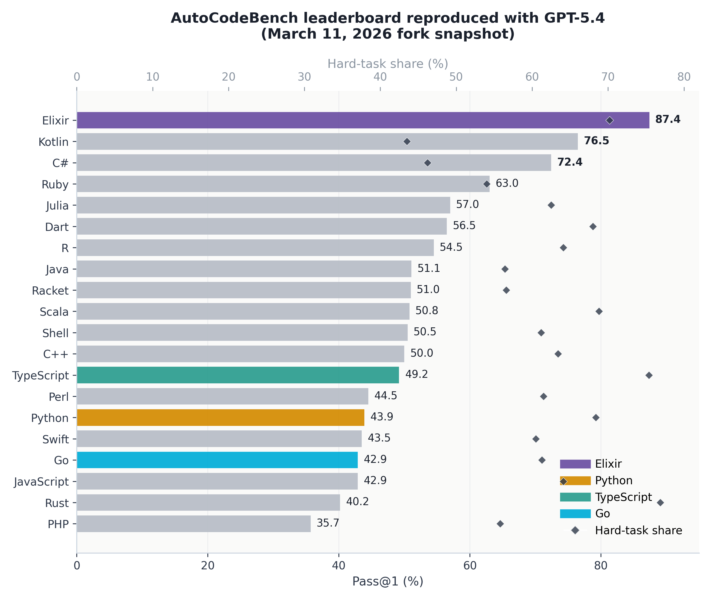
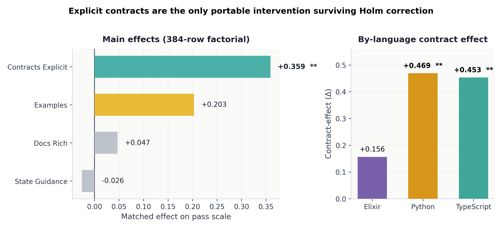

<div align="center">


# The Language Is the Prompt

**How Elixir Achieves Top-Tier Code Generation on AutoCodeBench**

*Gunther Schulz — CyberAgent, Inc.*

</div>

<p align="center">
  <a href="./paper/main.pdf">📄 Paper (EN)</a> •
  <a href="./paper/main_ja.pdf">📄 論文 (日本語)</a> •
  <a href="./paper/data/">📊 Data</a> •
  <a href="./results/">🧪 Full Results</a> •
  <a href="#key-findings">🔬 Key Findings</a> •
  <a href="#citation">📜 Citation</a>
</p>

<p align="center">
  
  
  
  
</p>

<div align="center">
  
</div>

---

## Abstract

Elixir achieves **87.4% Pass@1** on the AutoCodeBench Suite B evaluation, outperforming every other language in the benchmark including Python (53.1%), Kotlin (76.5%), and C# (72.4%). On hard tasks specifically, Elixir reaches **86.3%** where Python scores **31.6%** — a **55-point gap**.

This repository contains the full paper, experimental data, analysis scripts, and figures for our study investigating *why* certain programming languages are dramatically easier for LLMs to generate correct code in. The central finding: **language design choices act as implicit prompts** that guide or constrain LLM generation. Elixir's explicit design — immutability, pattern matching, pipeline operators, and design-by-contract via typespecs — provides structural information that functions like a built-in prompt engineering layer.

## Key Findings

**1. Language design is the strongest predictor of code generation success.**
Across 10 languages and 196 tasks (Suite B), Elixir leads by 11 points over the second-place language. The gap widens on harder tasks.

**2. Explicit contracts drive the largest factorial effect.**
A 2⁴ factorial analysis identifies `contracts_explicit` (typespecs + guards) as the largest main effect (Δ = +0.359, p = 0.007), larger than documentation quality, examples, or state guidance.

**3. Documentation quality is the second lever — but only a certain kind.**
Rich module docs with embedded examples boost Elixir from 42.9% (signature-only) to 84.3% (full docs) — a **+41.4 point** lift. Removing examples alone has no effect; removing the prose documentation drops performance sharply.

**4. Hard-task resilience is Elixir's defining trait.**
While all languages degrade on hard tasks, Elixir degrades the least (−10.3 pp from easy to hard). Python degrades by −50.4 pp over the same range.

**5. Results are robust across bootstrap, leave-one-out, and cross-validation checks.**
The contract effect holds at p < 0.05 under Holm correction across all robustness checks.

<div align="center">
  
</div>

## Repository Structure

```
.
├── paper/                      # The paper (primary content)
│   ├── main.tex                #   English LaTeX source
│   ├── main.pdf                #   Compiled English PDF
│   ├── main_ja.tex             #   Japanese LaTeX source (culturally adapted)
│   ├── main_ja.pdf             #   Compiled Japanese PDF
│   ├── build.sh                #   Build script (figures + compile + package)
│   ├── data/                   #   CSV data files used by figures
│   │   ├── leaderboard.csv
│   │   ├── difficulty_buckets.csv
│   │   ├── factorial_main_effects.csv
│   │   ├── contract_effect_by_language.csv
│   │   ├── suite_a.csv
│   │   └── robustness.csv
│   ├── figures/                #   Generated figure PDFs + PNGs
│   │   ├── generate_figures.py
│   │   └── generate_figures_ja.py
│   └── assets/                 #   Logos and cover art
├── results/                    # Extended analysis results
│   ├── elixir_error_taxonomy*.csv
│   ├── elixir_paper_*.csv
│   ├── elixir_common_task_*.csv
│   └── ...
├── scripts/                    # Analysis and evaluation scripts
├── AutoCodeBench/              # Original benchmark data (from upstream)
├── AutoCodeBench-V2/           # V2 benchmark data (from upstream)
└── arXiv-2508.09101v1/         # Original AutoCodeBench paper source
```

## Building the Paper

Requirements: `tectonic` (or `latexmk`/`pdflatex`), Python 3 with `matplotlib` and `numpy`.

```bash
cd paper

# Full build: figures → PDF → Overleaf zip → arXiv zip
./build.sh

# Individual steps
./build.sh figures       # Regenerate figures only
./build.sh compile       # Compile English PDF only
./build.sh overleaf      # Package for Overleaf upload
./build.sh arxiv         # Package for arXiv submission

# Japanese version
./build.sh figures-ja    # Regenerate Japanese figures
./build.sh compile-ja    # Compile Japanese PDF (requires tectonic + CJK fonts)
./build.sh all-ja        # Both steps
```

## Data

All experimental data is in `paper/data/` as CSV files. Key tables:

| File | Description |
|------|-------------|
| `leaderboard.csv` | Pass@1 scores for all 10 languages + feature metrics |
| `difficulty_buckets.csv` | Performance by difficulty tier (easy/medium/hard) |
| `factorial_main_effects.csv` | 2⁴ factorial design: effect sizes and p-values |
| `contract_effect_by_language.csv` | Contract presence effect per language |
| `suite_a.csv` | Documentation ablation conditions (Suite A) |
| `robustness.csv` | Bootstrap, leave-one-out, cross-validation intervals |

Extended analysis outputs (error taxonomies, cross-language correlations, failure audits) are in `results/`.

## Figures

Seven main figures, each available as PDF and PNG in both English and Japanese:

| # | Figure | Key Insight |
|---|--------|------------|
| 1 | Leaderboard | Elixir leads at 87.4% overall |
| 2 | Design space | Multi-metric language comparison |
| 3 | Difficulty resilience | Elixir's hard-task advantage |
| 4 | Suite A ablation | Documentation impact (+41.4 pp) |
| 5 | Factorial effects | Contracts = largest effect |
| 6 | Docs pipeline | Documentation quality analysis |
| A1 | Robustness | Cross-validation stability |

## Upstream Benchmark

This repository is a fork of [Tencent-Hunyuan/AutoCodeBenchmark](https://github.com/Tencent-Hunyuan/AutoCodeBenchmark), which provides the AutoCodeBench benchmark suite, sandbox evaluation infrastructure, and original leaderboard data. The benchmark evaluation tools in `AutoCodeBench/`, `AutoCodeBench-V2/`, `MultiLanguageSandbox/`, and `Inference/` come from the upstream project.

Our fork extends the benchmark with:
- A GPT-5.4 Medium evaluation run across all languages
- Extension language tracks (Gleam, Lean4, TypeScript Effect)
- The Elixir language-design study (this paper)

See [RESULTS.md](./RESULTS.md) for the full fork evaluation results.

## Citation

If you use our paper, data, or findings, please cite:

```bibtex
@article{schulz2026language,
  title={The Language Is the Prompt: How Elixir Achieves Top-Tier
         Code Generation on {AutoCodeBench}},
  author={Schulz, Gunther},
  year={2026},
  note={CyberAgent, Inc.}
}
```

If you use the AutoCodeBench benchmark itself, please also cite the original work:

```bibtex
@misc{chou2025autocodebenchlargelanguagemodels,
  title={AutoCodeBench: Large Language Models are Automatic Code Benchmark Generators},
  author={Jason Chou and Ao Liu and Yuchi Deng and Zhiying Zeng and Tao Zhang and
          Haotian Zhu and Jianwei Cai and Yue Mao and Chenchen Zhang and Lingyun Tan and
          Ziyan Xu and Bohui Zhai and Hengyi Liu and Speed Zhu and Wiggin Zhou and Fengzong Lian},
  year={2025},
  eprint={2508.09101},
  archivePrefix={arXiv},
  primaryClass={cs.CL},
  url={https://arxiv.org/abs/2508.09101},
}
```

## License

This repository is licensed under the terms of the [LICENSE](LICENSE) file.
