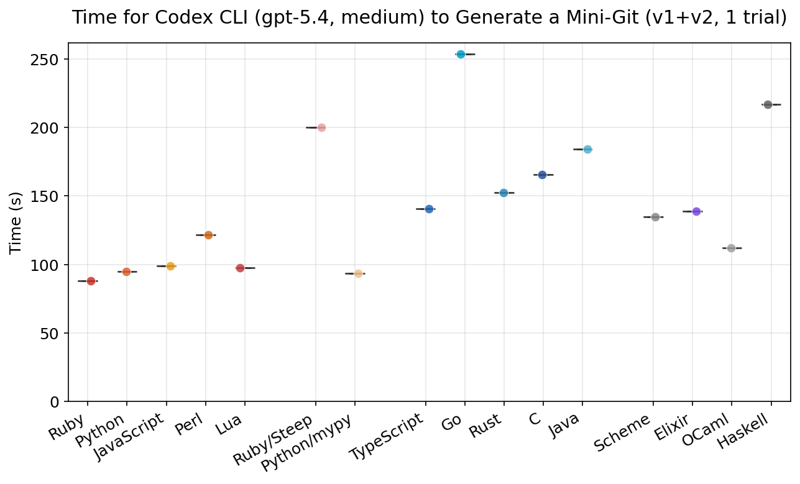
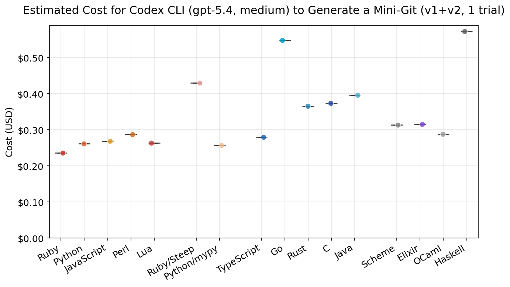
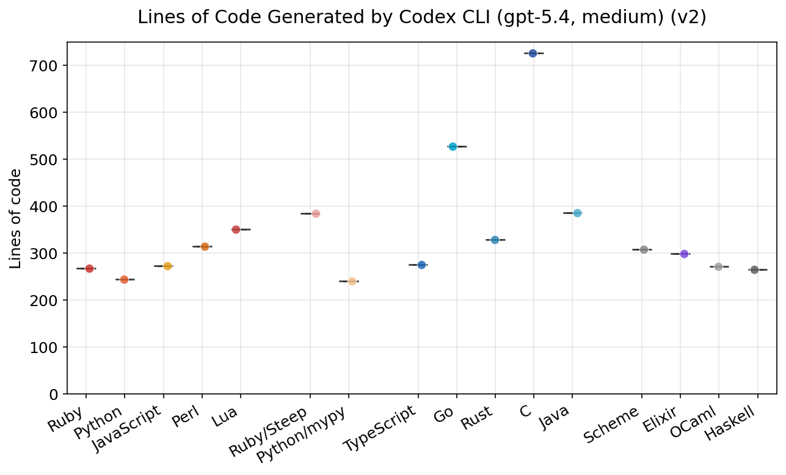
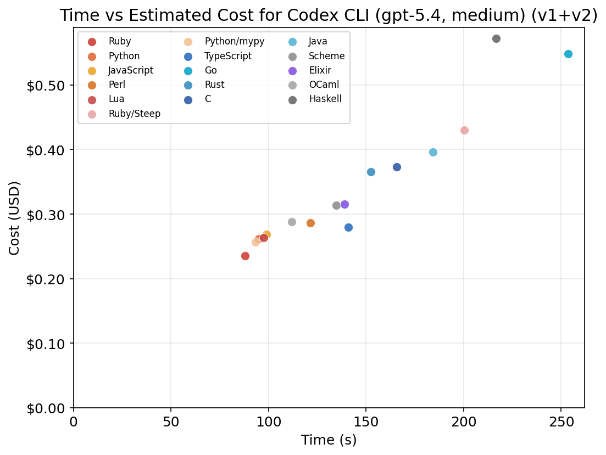
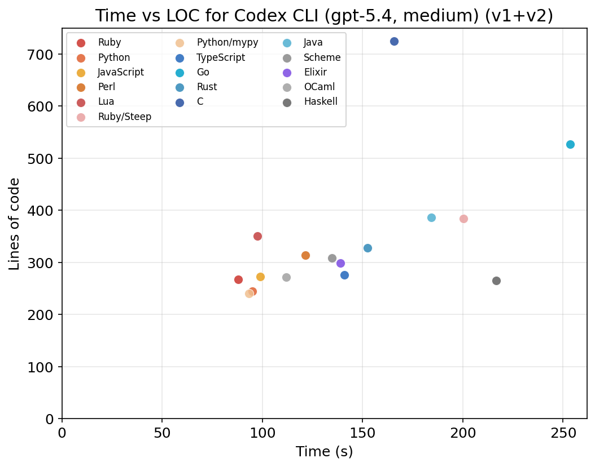

# Which Programming Language Is Best for GPT-5.4 Coding Agents?

An adapted version of [mame/ai-coding-lang-bench](https://github.com/mame/ai-coding-lang-bench) that benchmarks **Codex CLI with `gpt-5.4` at `medium` reasoning effort** across 16 language configurations, including **Elixir**.

## TL;DR

For this single-run Mac benchmark, **Ruby** was the fastest and cheapest overall. **Python/mypy**, **Python**, **Lua**, and **JavaScript** also performed well. **Elixir** landed in the middle of the pack and passed every test.

This repository no longer measures Claude Code. It measures **Codex CLI + GPT-5.4 medium**.

## What Changed From Upstream

- Swapped the runner from `claude -p` to `codex exec --json`.
- Added **Elixir** to the comparison set.
- Updated reporting and plotting to read Codex JSONL logs and current benchmark metadata.
- Updated cost accounting to use published **GPT-5.4 API pricing** from token usage, because Codex CLI emits usage counts but not direct cost values.
- Added local dependency manifests for plotting and macOS toolchains.

## Benchmark Task

The agent implements a simplified `mini-git` in two phases:

- `v1`: `init`, `add`, `commit`, `log`
- `v2`: `status`, `diff`, `checkout`, `reset`, `rm`, `show`

Each implementation must expose an executable named `./minigit` and pass the provided shell test suites.

## Languages

| Category | Languages |
|----------|-----------|
| Dynamic | Python, Ruby, JavaScript, Perl, Lua |
| Dynamic + type checker | Python/mypy, Ruby/Steep |
| Static | TypeScript, Go, Rust, C, Java |
| Functional / BEAM | Scheme, OCaml, Haskell, Elixir |

## Current Results

Environment:

- Date: March 16, 2026
- Runner: Codex CLI `0.114.0`
- Model: `gpt-5.4`
- Reasoning effort: `medium`
- Trials per language: `1`
- Platform: macOS / Apple Silicon

All 16 language configurations passed both phases in this run.

| Language | Tests passed | Total time | Estimated cost | LOC (v2) |
|----------|-------------:|-----------:|---------------:|---------:|
| Ruby | 2/2 | 87.9s | $0.24 | 267 |
| Python/mypy | 2/2 | 93.4s | $0.26 | 240 |
| Python | 2/2 | 94.9s | $0.26 | 244 |
| Lua | 2/2 | 97.4s | $0.26 | 350 |
| JavaScript | 2/2 | 99.0s | $0.27 | 273 |
| OCaml | 2/2 | 112.0s | $0.29 | 271 |
| Perl | 2/2 | 121.6s | $0.29 | 314 |
| Scheme | 2/2 | 134.8s | $0.31 | 308 |
| Elixir | 2/2 | 139.0s | $0.32 | 299 |
| TypeScript | 2/2 | 140.8s | $0.28 | 276 |
| Rust | 2/2 | 152.3s | $0.37 | 328 |
| C | 2/2 | 165.6s | $0.37 | 725 |
| Java | 2/2 | 184.2s | $0.40 | 386 |
| Ruby/Steep | 2/2 | 200.2s | $0.43 | 384 |
| Haskell | 2/2 | 216.7s | $0.57 | 265 |
| Go | 2/2 | 253.6s | $0.55 | 527 |

### Graphs











## Observations From This Run

- Ruby was the fastest and cheapest configuration.
- `python/mypy` was unexpectedly competitive under GPT-5.4 medium, finishing slightly ahead of plain Python in total time on this run.
- Elixir passed both phases and landed near the middle, faster than Rust, C, Java, Ruby/Steep, Haskell, and Go.
- `ruby/steep` incurred a much larger overhead than `python/mypy`.
- OCaml remained compact and reasonably fast.
- Every configuration passed, so this run says more about efficiency than reliability.

## Important Caveats

- This result set is **one trial per language**, not a statistically stable distribution. The plots are still useful for inspection, but variance claims need more trials.
- Costs are **estimated** from token usage and published GPT-5.4 pricing, not emitted directly by Codex CLI.
- The benchmark measures **prototype-scale code generation** on a constrained task. It does not answer which language is best for long-lived production systems.

For the full generated summary, see [results/report.md](./results/report.md).

## Reproducing

### Install Dependencies

macOS toolchains:

```bash
brew bundle
```

Python packages for plotting and the `python/mypy` variant:

```bash
python3 -m pip install --user -r requirements.txt mypy
```

Ruby type checker for the `ruby/steep` variant:

```bash
PATH="/opt/homebrew/opt/ruby/bin:$PATH" gem install --user-install steep
```

TypeScript runner:

```bash
npm install -g tsx
```

You also need:

- `codex` on your `PATH`
- a working Codex/OpenAI login or API-backed Codex setup

### Run The Benchmark

Single full pass:

```bash
ruby benchmark.rb --trials 1
```

Single language:

```bash
ruby benchmark.rb --lang elixir --trials 1
```

Split batches and merge them:

```bash
ruby benchmark.rb --trials 1 --start 1
ruby benchmark.rb --trials 1 --start 2 --append
```

Generate report and figures:

```bash
ruby report.rb
python3 plot.py results/results.json
```

## Repository Structure

- `benchmark.rb`: benchmark runner
- `report.rb`: markdown report generator
- `plot.py`: figure generator
- `results/results.json`: raw results for the current benchmark set
- `results/meta.json`: benchmark environment metadata
- `results/report.md`: generated summary report
- `figures/*.png`: generated charts
- `logs/*.jsonl`: raw Codex JSONL logs
- `generated/`: generated project directories from benchmark runs

## Notes

- The benchmark now defaults to **replacing** `results/results.json`. Use `--append` when stitching together multi-batch runs.
- `plot.py` forces the non-interactive `Agg` backend so figure generation works in headless shells on macOS.
- Elixir implementations are prompted toward an executable `minigit` script rather than a full Mix project unless Mix is necessary.
