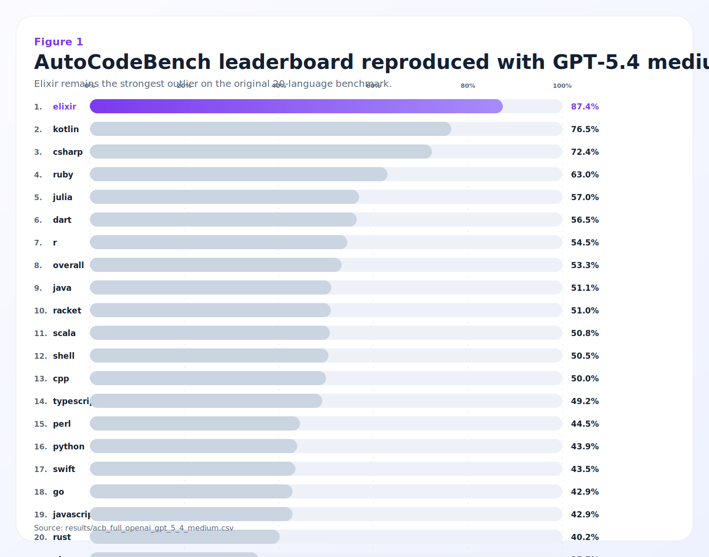
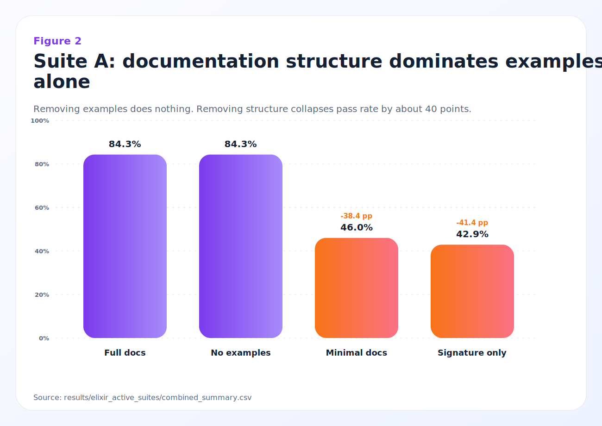
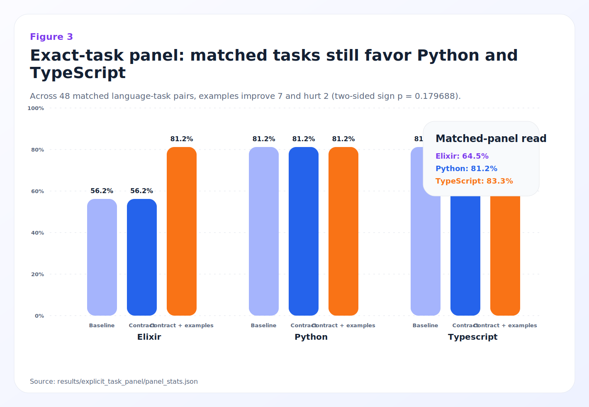

# Elixir and the Design of LLM-Friendly Programming Languages: Evidence from AutoCodeBench and Controlled Ablations

---

## Abstract

Large language models (LLMs) exhibit substantial performance variation across programming languages on code generation benchmarks, yet the relationship between language design and generation quality remains poorly understood. We report a controlled reproduction of AutoCodeBench (ACB) using GPT-5.4 in which Elixir, a low-resource functional language running on the BEAM VM, achieves 87.4% Pass@1 across 198 benchmark problems, exceeding the 20-language mean of 53.3% by 34.1 percentage points and outperforming the next-best language (Kotlin, 76.5%) by 10.9 points. Elixir also leads the hard-problem bucket at 86.3%, well above the runner-up (C#, 54.3%). We then conduct a nine-suite analysis program combining benchmark-artifact controls, cross-language proxy analysis, full-scale paired ablations over the 198-task Elixir slice, a recurring-task fixed-effects sanity check, a formal first-failure taxonomy, and an auxiliary exact-task multilingual panel with 144 executable rows (16 tasks, 3 languages, 3 framing conditions). The results show that Elixir's ACB advantage (a) survives normalization for difficulty and problem length (+42.7 points above expected), (b) is most strongly explained within Elixir by documentation and task-framing explicitness (`84.3%` with full docs, `84.3%` with examples removed, `46.0%` with minimal docs, `42.9%` with signatures only), but (c) does not replicate as a universal language lead on the matched panel, where Elixir scores 64.6% versus Python 81.2% and TypeScript 83.3%. Richer contract wording alone does not change matched-panel performance, while concrete examples improve the panel overall only directionally (`83.3%` vs `72.9%`, `7` improvements and `2` degradations, exact sign `p=0.179688`). The resulting interpretation is narrower than a feature-by-feature account: Elixir appears unusually model-friendly on ACB because language-level explicitness and benchmark task framing reinforce one another, while the most portable design lesson is broader, namely that task intent, API contracts, and executable examples should be made locally legible.

**Keywords:** code generation, programming language design, LLM benchmark, Elixir, documentation, task framing, pattern matching, immutability, AutoCodeBench, predictive burden, information density, agent-centric design

---

## 1. Introduction

The past three years have seen rapid improvement in LLM-based code generation, with frontier models now achieving 50–90% Pass@1 on standard benchmarks depending on language and difficulty. However, a persistent and underexplored observation is that *the choice of target programming language dramatically affects generation quality* — often more than the choice of model or prompting strategy.

This observation challenges two common assumptions:

1. **The data-volume hypothesis:** that LLM code generation quality is primarily determined by the volume of training data in a given language. If true, Python and JavaScript should dominate every benchmark.
2. **The functional-programming hypothesis:** that purely functional languages, with their mathematical foundations and referential transparency, should be easiest for models to reason about. If true, Haskell and OCaml should lead.

Neither assumption holds. On AutoCodeBench [1], Python achieves only 43.9% and JavaScript 42.9% despite being the most-represented languages in pretraining corpora. And recent work on FPEval [2] shows that pure functional languages (Haskell, OCaml) actually *underperform* imperative baselines. Meanwhile, Elixir — a dynamically-typed, BEAM-based functional language with approximately 0.1% representation in typical code corpora [3] — achieves the highest Pass@1 of any language tested.

This paper asks: **Why?**

We argue that the answer lies not in data volume or paradigm purity, but in a specific combination of language-design properties that reduce the *predictive burden* on the model — the amount of implicit context, hidden state, and structural ambiguity that the model must correctly infer to produce working code. We formalize this as the **Explicitness Hypothesis**:

> *A programming language's suitability for LLM code generation is predicted by the degree to which its design makes program intent, control flow, data transformations, and error handling explicit and locally visible in the syntax.*

We test this hypothesis through:

- A full-scale reproduction of ACB across 20 languages with GPT-5.4 (N=3,920)
- A nine-suite research program spanning active ablations, proxy analyses, artifact controls, and repo-scale scaffolding
- A new exact-task auxiliary panel across Elixir, Python, and TypeScript to partially overcome ACB's missing shared task identifiers
- Proxy metric analysis correlating design properties with Pass@1 across all 20 languages
- Active intervention experiments that modify Elixir task framing and code style to remove or alter specific properties

### 1.1 Contributions

1. **Empirical confirmation** that Elixir's benchmark advantage on ACB is real, not a benchmark artifact, surviving normalization for difficulty, problem length, and test complexity (+42.7 points above expected, §5).
2. **Full-scale active-ablation evidence** that the strongest currently supported within-Elixir causal signal is documentation and task framing, not examples alone, with large and statistically durable drops when documentation structure is removed (§6).
3. **A strengthened same-task follow-up design** via a canonically validated explicit-task panel (144 executable rows) showing that Elixir's leaderboard dominance does not automatically persist once tasks are tightly matched, while concrete examples rescue a small subset of tasks and lift the panel overall without a decisive paired-significance result (§4, §6).
4. **A stronger statistical methodology** for studying language effects in code generation, including paired ablations with exact McNemar tests and Holm correction, a recurring-task fixed-effects sanity check, an explicit-task matched panel, and a formal first-failure taxonomy with confidence intervals and exact tests (§4-§6).
5. **A refined design thesis** for human-AI programming languages: prioritize legibility of tasks, public contracts, concrete examples, state flow, and local reasoning, while treating broader claims about pattern matching or tagged tuples as suggestive rather than settled (§7-§8).

---

## 2. Background: Autoregressive Code Generation and Predictive Burden

### 2.1 Local Prediction Under Bounded Context

Autoregressive language models generate code token by token under a bounded context window. At each decoding step, the model conditions on the visible prompt and previously generated tokens, then commits to a next-token continuation. This mechanism is powerful, but it makes generation sensitive to how much relevant information is available in local context. When types, contracts, data shape, and control-flow cues are nearby and overtly represented, code generation is comparatively stable. When correctness depends on distant declarations, implicit conventions, or hidden state transitions, the model must infer more latent structure and error rates rise.

This observation motivates the central construct used throughout the paper: **predictive burden**, the amount of latent information the model must recover correctly in order to produce an executable solution. Predictive burden is not solely a property of the model; it is also shaped by the prompt, the task specification, and the target language.

### 2.2 Language Design as a Constraint Surface

Programming languages differ in how much semantic information they force into locally visible structure. The same logical task can therefore present very different decoding difficulty depending on whether the language exposes data shape, branch structure, state flow, and return conventions directly in syntax.

For example, Elixir commonly expresses dispatch in multi-clause function heads:

```elixir
def calculate_discount({:ok, %Order{total: total}}) when total > 100 do
  {:ok, total * 0.9}
end
def calculate_discount({:ok, %Order{total: total}}) do
  {:ok, total}
end
def calculate_discount({:error, _} = error), do: error
```

Here, input shape, branch boundaries, and result form are all locally exposed. By contrast, an imperative implementation with mutation, sentinel returns, and convention-driven branching can force the model to infer more unstated behavior:

```python
def calculate_discount(order):
    if order is None:
        return None
    if not hasattr(order, "total"):
        raise AttributeError(...)
    if order.total > 100:
        order.discounted_total = order.total * 0.9
        return order
    return order
```

In this second style, several semantic decisions are underdetermined by surface structure alone: null behavior, mutation policy, return-shape expectations, and downstream handling conventions. The paper's core hypothesis follows directly from this contrast: **languages and ecosystems that make task intent, control flow, data transformation, and error handling locally legible reduce predictive burden and therefore improve code-generation reliability.**

---

## 3. Related Work

### 3.1 Multilingual Code Generation Benchmarks

**HumanEval** [4] and **MBPP** [5] established single-language (Python) benchmarks for code generation. **MultiPL-E** [6] extended HumanEval and MBPP to 18 languages via automated translation, finding that language frequency in training data is a strong but not sole predictor of performance. **AutoCodeBench** [1] scales to 3,920 problems across 20 languages with a fully automated generation pipeline, providing the first benchmark where low-resource languages like Elixir can be evaluated at scale.

### 3.2 Functional Programming and LLMs

Le-Cong et al. [2] introduced **FPEval/FPBench**, evaluating LLMs on 721 tasks across Haskell, OCaml, Scala, and Java. Their key finding — that pure FP languages underperform imperative baselines — directly contradicts the naive functional-programming hypothesis. Baseline pass rates are stark: Haskell 14.5%, OCaml 9.43%, Scala 19.28%, versus Java 22.19%. Even with advanced models, the structural gap persists (Haskell rises to 42.34%, Scala to 52.16%, but the pure-FP deficit remains). Furthermore, FPEval reveals a pervasive "imperative bias" in LLM outputs: models generate syntactically valid but non-idiomatic functional code, injecting procedural loops, mutable variable workarounds, and nested if-else blocks that bypass native higher-order abstractions.

This distinction matters for the present study. Elixir's success cannot be attributed to "functional programming" in the abstract, since purer functional languages underperform in FPEval. The more plausible distinction is that Elixir occupies a pragmatic middle ground: it preserves immutability and pattern matching while avoiding the higher inference burden imposed by purity, dependent typing, or richer type-level machinery.

Notably, FPEval also demonstrates that LLMs possess latent capacity for self-repair: when supplied with explicit static analysis feedback identifying functional violations, models can successfully refactor imperative outputs into idiomatic functional code [2]. This suggests the bottleneck is not model capability but the *information available during generation* — a point we return to in §7.

### 3.3 Language Properties and Generation Quality

**Type-constrained code generation** [7] (ETH Zurich, PLDI 2025) demonstrated that imposing type constraints during decoding reduces compilation errors by >50% and improves functional correctness by 3.5–5.5%. This establishes that explicit structural constraints help models, supporting our broader explicitness hypothesis.

**Programming Language Confusion** [8] showed that LLMs confuse syntactically similar languages at rates up to 42% (Language Confusion Pass Rate). Syntactic similarity is the primary confusion vector: models reflexively migrate from low-resource to high-resource languages, overwhelmingly favoring Python or transitioning between C-style pairs (C#/Java, TypeScript/JavaScript). Intriguingly, fMRI studies of human programmers show that distinct languages activate compartmentalized neural patterns, enabling clear paradigm boundaries [8]. LLMs, by contrast, appear to use fluid, overlapping latent representations for all source code, prioritizing high-frequency token patterns over linguistic fidelity. Languages with distinctive syntactic signatures — like Elixir's pipe operator (`|>`), pattern-matching clauses, and `do/end` blocks — may be structurally resistant to this confusion.

**"LLMs Love Python"** [9] documented that LLMs use Python 90–97% of the time when unconstrained, even when Python is suboptimal. In project initialization tasks where Python is demonstrably wrong (high-concurrency servers, embedded systems), models still default to Python 58% of the time with 0% Rust utilization. Models contradict their own language recommendations in 83% of project scenarios — correctly stating that Rust is required, then generating the scaffold in Python [9]. Library selection shows similar distortion: NumPy is injected unnecessarily in 48% of cases, and legacy frameworks (Flask) are favored over modern alternatives (FastAPI) by margins of 36–79% [9].

**The Matthew Effect** [14] formalizes this bias as a self-reinforcing cycle: LLMs trained on popular code generate more popular code, which in turn becomes training data for later systems. Elixir's ability to outperform Python despite this structural disadvantage therefore suggests that language design can matter enough to offset substantial corpus-frequency asymmetries.

### 3.4 Low-Resource Language Code Generation

Wu et al. [3] surveyed 111 papers covering 40+ languages and found that low-resource languages systematically underperform high-resource ones. Elixir's top ranking as a low-resource language is therefore an extreme anomaly requiring explanation beyond data volume.

### 3.5 Practitioner Perspectives

Daniel [10] argued that Elixir's immutability enables local reasoning (every function receives all needed data as input), its documentation culture ensures high training-signal quality, and its API stability means older training data remains valid. Dashbit [11] emphasized the pipe operator's role in defining clear data transformation steps.

### 3.6 Information Density and the Uniform Information Density Hypothesis

Recent work on the **Uniform Information Density (UID) hypothesis** [16] provides a theoretical lens for understanding why certain language constructs are easier for models to generate. The UID hypothesis, originally from psycholinguistics, posits that effective communication maintains a roughly uniform rate of information flow. Applied to LLM reasoning traces, research shows that *successful* code generation avoids sharp spikes in information density, while generative traces with irregular, concentrated bursts of entropy reliably correlate with logical failures and hallucinations [16].

This connects to the **Explicitness Hypothesis** from translation universals [17]: translated or artificially generated texts tend to be more explicit, overtly structured, and less ambiguous than natural source texts. LLMs — lacking intrinsic spatial awareness of a codebase — compensate by generating highly explicit structural representations. They excel in environments where dependencies, data transformations, and control flow are made overtly visible in the local lexical scope, and falter in dynamic languages that rely on implicit global state or ambiguous syntax [17].

### 3.7 Agent-Centric Language Design

Ronacher [15] articulated design principles for programming languages optimized for autonomous coding agents, observing that the primary constraint on AI agents is their bounded context window and lack of spatial awareness across a repository. Key principles include: (a) **greppability** — agents rely on search to navigate codebases, so languages must mandate explicit, un-aliased module prefixes; (b) **eradication of barrel files** — re-export proxy patterns (common in JavaScript/TypeScript) decouple implementation from location, confusing agent navigation; (c) **explicit effect markers** in function signatures (e.g., `fn calculate() needs { time, database }`); and (d) **deterministic compilation** — languages where transpiled code can run despite failing type checks "gaslight" agents into believing broken code is valid [15]. These agent-centric constraints overlap substantially with the properties we identify as beneficial for Elixir.

---

## 4. Methodology

### 4.1 Benchmark Reproduction

We reproduced AutoCodeBench [1] using the original benchmark suite of 3,920 problems across 20 programming languages. All problems were evaluated with GPT-5.4 (medium reasoning) using Pass@1 (single-attempt correctness via sandbox execution against private test suites).

**Languages tested** (N problems each): C++ (186), C# (199), Dart (200), Elixir (198), Go (191), Java (188), JavaScript (184), Julia (200), Kotlin (200), Perl (200), PHP (199), Python (196), R (198), Racket (196), Ruby (200), Rust (199), Scala (199), Shell (188), Swift (200), TypeScript (199).

**Difficulty distribution:** Problems are classified as Easy, Medium, or Hard based on DeepSeek-Coder-V2-Lite's ability to solve them in 10 attempts (0/10 correct = Hard, 1–5 = Medium, 6+ = Easy) [1].

### 4.2 Hypothesis Suite Design

We designed nine research suites, each targeting a specific hypothesis about Elixir's advantage:


| Suite | Hypothesis                                 | Method                                                             |
| ----- | ------------------------------------------ | ------------------------------------------------------------------ |
| **A** | Documentation quality drives success       | Ablate doc completeness (full → signature-only)                    |
| **B** | Corpus cleanliness explains the gap        | Measure code quality proxies across languages                      |
| **C** | Formatter-driven uniformity helps          | Measure stylistic entropy and stability                            |
| **D** | Control-flow explicitness makes intent legible | Replace pattern-matching-heavy forms with equivalent alternatives |
| **E** | Explicit result contracts reduce return ambiguity | Replace `{:ok, v}/{:error, r}` with alternatives               |
| **F** | Explicit state flow reduces reasoning burden | Vary mutability/state style (pipeline vs. rebinding vs. state threading) |
| **G** | Doc–test–code alignment matters            | Measure alignment across documentation, tests, and code            |
| **H** | The advantage is a benchmark artifact      | Normalize for difficulty, length, and error modes                  |
| **I** | The advantage doesn't extend to real repos | Test on framework-scale Phoenix/Ecto tasks                         |


### 4.3 Proxy Metrics

For each suite, we computed proxy metrics across all 20 languages from the benchmark's canonical solutions:

**Control-Flow Explicitness Score** (Suite D):
$$S_{\text{cf}}(L) = \alpha \cdot \bar{P}(L) + \beta \cdot \bar{D}(L) - \gamma \cdot \bar{B}(L)$$
where $\bar{P}(L)$ is the mean pattern-matching signal count for language $L$, $\bar{D}(L)$ is the mean multi-clause dispatch count, $\bar{B}(L)$ is the mean imperative branch count, and $\alpha, \beta, \gamma$ are normalization weights.

**Mutability Burden Score** (Suite F):
$$M(L) = \bar{A}(L) + \bar{U}(L) + \bar{W}(L)$$
where $\bar{A}(L)$ is mean assignment count, $\bar{U}(L)$ is mean update-operation count, and $\bar{W}(L)$ is mean mutable-state keyword count.

**Artifact Control Expected Rate** (Suite H):
$$\hat{p}_{\text{expected}}(L) = \sum_{d \in \{E,M,H\}} \frac{n_d(L)}{N(L)} \cdot \bar{p}_d(\neg L)$$
where $\bar{p}_d(\neg L)$ is the leave-one-language-out mean pass rate at difficulty level $d$, providing an expected rate that accounts for problem difficulty composition.

### 4.4 Active Ablation Protocol

For suites A, D, E, and F, we conducted active ablation experiments:

- **Task selection:** the full Elixir benchmark slice from the corrected main run (198 source tasks). Each source task is replicated across 3-4 paired conditions, yielding 792 execution rows for Suites A, D, and F, and 594 execution rows for Suite E.
- **Conditions:** 3-4 conditions per suite, each modifying a specific language-design property while keeping the underlying task fixed.
- **Model:** GPT-5.4 with medium reasoning (same as the full benchmark).
- **Evaluation:** Sandbox execution against the same test suites.
- **Missing-as-failure:** Any generation that failed to produce parseable code was counted as a failure, not dropped.
- **Inference:** For each condition we report Wilson confidence intervals, paired deltas versus the suite baseline, exact McNemar/binomial p-values on discordant pairs, bootstrap confidence intervals for delta estimates, and Holm-corrected p-values across all active intervention contrasts.

### 4.5 Additional Statistical Checks

To reduce dependence on language-level proxy comparisons, we add three auxiliary analyses.

**Recurring-task fixed-effects sanity check.**
ACB-Full does not expose an explicit shared cross-language task identifier, so we construct a conservative matched subset using exact normalized first-line title matches, keeping only clusters where each language appears at most once. Let $y_{l,c} \in \{0,1\}$ denote whether language $l$ passed cluster $c$. Our within-cluster residual estimator is:

$$r_{l,c} = y_{l,c} - \bar{y}_c, \quad \bar{y}_c = \frac{1}{|L_c|}\sum_{l \in L_c} y_{l,c}$$

For Elixir-specific comparisons we also compute:

$$\Delta_c^{(\text{elixir})} = y_{\text{elixir},c} - \frac{1}{|L_c|-1}\sum_{l \in L_c \setminus \{\text{elixir}\}} y_{l,c}$$

and bootstrap over matched clusters.

**Formal first-failure taxonomy.**
For each row we record the first non-passed execution outcome observed in demo or full tests and classify it into compile, runtime, wrong-answer, or other. We report Wilson intervals for category rates and Fisher exact tests for Elixir-versus-rest comparisons, again with Holm correction. Because the sandbox frequently reports failed assertions as `RUNTIME_ERROR`, runtime failures are additionally decomposed into assertion-driven test aborts, language exceptions, dependency issues, and timeouts.

**Explicit-task cross-language panel.**
To partially overcome the absence of shared multilingual task ids without rerunning ACB-Full, we construct an auxiliary benchmark of 16 hand-authored executable tasks, each implemented in Elixir, Python, and TypeScript under 3 prompt conditions (`baseline_compact`, `rich_contract`, `rich_contract_examples`), yielding 144 canonically validated rows. Let $y_{l,t,c} \in \{0,1\}$ denote success for language $l$, task $t$, and condition $c$. We report per-language pass rates and the paired task-language estimator

$$\bar{\Delta}_{c_1,c_0} = \frac{1}{|L||T|}\sum_{l \in L}\sum_{t \in T}(y_{l,t,c_1} - y_{l,t,c_0})$$

along with discordant win/loss counts. This panel remains small and statistically underpowered; we use it as a methodological strengthening experiment, not as a replacement leaderboard.

### 4.6 Claim Evaluation Criteria

Because this paper mixes benchmark-wide observational results with matched within-language interventions, we classify claims using a simple reporting rule rather than treating every positive correlation as equally probative:

- **Strongly supported:** either (a) a matched active intervention with Holm-adjusted $p < 0.05$ and a practically large absolute delta (roughly $\ge 10$ percentage points), or (b) a benchmark-wide effect that survives all artifact controls with the same sign and large magnitude.
- **Directional:** sign-consistent effects, proxy correlations, or paired interventions that move in the predicted direction but do not survive multiplicity correction.
- **Not supported:** null, contradictory, or low-power results that fail to establish even a directional pattern.

This classification is used explicitly in §6-§7 so that the paper's narrative matches the strength of the evidence.

### 4.7 Claims and Evidence at a Glance

**Table 0.** Claim-level summary used throughout the paper


| Claim | Main Evidence | Estimator | Quantitative Signal | Verdict |
| ----- | ------------- | --------- | ------------------- | ------- |
| Elixir's ACB leaderboard advantage is real after artifact controls | ACB-Full + Suite H | Observed minus adjusted expectation | `+42.7` points vs difficulty+question-length expectation | **Strong** |
| Documentation structure materially drives Elixir performance | Suite A | Paired delta vs `full_docs` | `minimal_docs -38.4`, `signature_only -41.4` | **Strong** |
| Examples alone explain Elixir's advantage | Suite A | `reference_no_examples` vs `full_docs` | `0.0` point delta | **Not established** |
| Concrete examples directionally help the matched panel, but not uniformly by language | Explicit-task panel | Paired sign test | `7` improvements, `2` degradations, exact sign `p=0.179688` | **Directional** |
| Elixir universally dominates once tasks are tightly matched | Explicit-task panel | Per-language pass rate | Elixir `64.6%`, Python `81.2%`, TypeScript `83.3%` | **Not established** |
| Control flow is the primary isolated driver | Suite D + leave-one-out proxies | Paired deltas and sensitivity analysis | all deltas within `±3` points | **Not established** |
| Explicit contracts and explicit state flow are helpful secondary contributors | Suites E and F | Paired deltas vs baseline | contracts `+3.0`; state-flow `+5.1` to `+5.6` | **Directional** |


### 4.8 Threats to Validity

We distinguish the main validity risks explicitly so that causal claims are matched to the strength of the evidence.

**Construct validity.**
The main construct in this paper is "explicitness," which mixes language-level properties with prompt-level task legibility. Suite A and the explicit-task panel show clearly that task framing is part of the effect, but they do not imply that all explicitness comes from the language alone. We therefore avoid treating task framing, documentation culture, and syntax as interchangeable.

**Internal validity.**
The strongest internal-validity risk is accidental benchmark or runtime bias. We mitigate this through corrected local execution, canonical validation of the explicit-task panel, paired within-task ablations, missing-as-failure accounting, and formal failure-taxonomy checks. But the explicit-task panel remains hand-authored, so its design choices are still a possible intervention source.

**External validity.**
The main benchmark evidence comes from isolated function/class tasks, and the explicit-task panel covers only Elixir, Python, and TypeScript. So the study does not yet establish that the same causal ordering holds in large repositories, in framework-heavy code, or across the full ecosystem of programming languages.

**Statistical conclusion validity.**
The full-scale Elixir ablations are reasonably powered, but the matched multilingual panel is not. Its exact-task result is valuable because it provides cleaner task alignment, not because it is large. We therefore treat its example effect as directional (`p=0.179688`) and do not overstate null or reversal results from that panel.

---

## 5. Results: Benchmark-Wide Performance

### 5.1 Overall Rankings

Table 1 presents the full cross-language results from our GPT-5.4 reproduction.

**Table 1.** Pass@1 by language on AutoCodeBench (GPT-5.4, N=3,920)


| Rank | Language   | N   | Pass@1    | Hard % | Hard Pass@1 |
| ---- | ---------- | --- | --------- | ------ | ----------- |
| 1    | **Elixir** | 198 | **87.4%** | 70.2%  | **86.3%**   |
| 2    | Kotlin     | 200 | 76.5%     | 43.5%  | 50.6%       |
| 3    | C#         | 199 | 72.4%     | 46.2%  | 54.3%       |
| 4    | Ruby       | 200 | 63.0%     | 54.0%  | 45.4%       |
| 5    | Julia      | 200 | 57.0%     | 62.5%  | 38.4%       |
| 6    | Dart       | 200 | 56.5%     | 68.0%  | 47.1%       |
| 7    | R          | 198 | 54.5%     | 64.1%  | 39.4%       |
| 8    | Java       | 188 | 51.1%     | 56.4%  | 31.1%       |
| 9    | Racket     | 196 | 51.0%     | 56.6%  | 41.4%       |
| 10   | Scala      | 199 | 50.8%     | 68.8%  | 38.0%       |
| 11   | Shell      | 188 | 50.5%     | 61.2%  | 25.2%       |
| 12   | C++        | 186 | 50.0%     | 63.4%  | 34.7%       |
| 13   | TypeScript | 199 | 49.2%     | 75.4%  | 38.0%       |
| 14   | Perl       | 200 | 44.5%     | 61.5%  | 20.3%       |
| 15   | Python     | 196 | 43.9%     | 68.4%  | 26.9%       |
| 16   | Swift      | 200 | 43.5%     | 60.5%  | 33.9%       |
| 17   | Go         | 191 | 42.9%     | 61.3%  | 23.9%       |
| 18   | JavaScript | 184 | 42.9%     | 64.1%  | 24.6%       |
| 19   | Rust       | 199 | 40.2%     | 76.9%  | 26.8%       |
| 20   | PHP        | 199 | 35.7%     | 55.8%  | 15.3%       |


*Overall mean: 53.3%. Elixir delta from mean: +34.1 pp.*



### 5.2 The Hard-Problem Signal

The most diagnostic signal is performance on hard problems. Elixir's 86.3% hard-problem pass rate is not a marginal lead — it is a *qualitative separation* from the field:

**Table 2.** Pass@1 by difficulty level, top 5 languages


| Language   | Easy   | Medium | Hard      | Hard N | Hard-to-Easy Ratio |
| ---------- | ------ | ------ | --------- | ------ | ------------------ |
| **Elixir** | 100.0% | 87.0%  | **86.3%** | 139    | **0.863**          |
| C#         | 91.8%  | 82.6%  | 54.3%     | 92     | 0.592              |
| Kotlin     | 98.3%  | 94.5%  | 50.6%     | 87     | 0.515              |
| Ruby       | 87.2%  | 80.0%  | 45.4%     | 108    | 0.521              |
| Dart       | 90.5%  | 69.8%  | 47.1%     | 136    | 0.520              |


Elixir's Hard-to-Easy ratio of 0.863 means it loses almost no performance on hard problems. For comparison, the 20-language mean Hard-to-Easy ratio is 0.400 — models typically lose 60% of their easy-problem capability on hard problems. Elixir loses only 13.7%.

This is the main benchmark-wide result of the paper: **Elixir's advantage is concentrated on the hard-problem subset, where most other languages lose substantially more performance.**

### 5.3 Failure Mode Analysis

We formalized failure analysis using the **first non-passed execution outcome** in either the demo or full test stage, then classified each row into compile, runtime, wrong-answer, or other. This is stricter than heuristic failure counting and avoids mixing later-stage outcomes into the taxonomy.

**Table 3.** First-failure taxonomy for selected languages


| Language   | Compile | Runtime | Wrong Answer | Other | Pass@1 |
| ---------- | ------- | ------- | ------------ | ----- | ------ |
| **Elixir** | **0**   | **25**  | **0**        | **0** | 87.4%  |
| Kotlin     | 0       | 47      | 0            | 0     | 76.5%  |
| C#         | 0       | 54      | 1            | 0     | 72.4%  |
| TypeScript | 0       | 15      | 86           | 0     | 49.2%  |
| Python     | 0       | 110     | 0            | 0     | 43.9%  |
| C++        | 24      | 69      | 0            | 0     | 50.0%  |


Elixir still stands out operationally:

- `0` compile failures
- `0` wrong-answer failures under the sandbox taxonomy
- only `25` total first failures out of `198` rows

However, the formal taxonomy also forces a careful interpretation. In this sandbox, many failed assertions are surfaced as `RUNTIME_ERROR`, so runtime failures are not synonymous with "language-level crashes." After conditioning on failure and applying Holm correction, Elixir does **not** exhibit a strongly distinct failure-mode mix relative to the rest of the field; the only surviving difference is the trivial one that Elixir has fewer runtime failures across all rows because it passes much more often overall.

For Elixir specifically, the 25 runtime failures decompose into:

- `7` assertion-driven test aborts (`28.0%`)
- `2` clear language exceptions (`8.0%`)
- `16` other runtime failures (`64.0%`)

The most conservative interpretation is therefore not that Elixir has a unique semantic failure profile, but that it reaches failure states much less often in the first place.

### 5.4 Artifact Controls (Suite H)

To rule out the possibility that Elixir simply received easier problems, we applied three normalization methods:

**Table 4.** Artifact control results


| Control Method                | Expected | Observed | Delta     |
| ----------------------------- | -------- | -------- | --------- |
| Difficulty only               | 47.0%    | 87.4%    | **+40.4** |
| Difficulty + question length  | 44.6%    | 87.4%    | **+42.7** |
| Difficulty + full test length | 50.5%    | 87.4%    | **+36.8** |


All three methods show that Elixir materially exceeds expectation under the available controls. The difficulty + question length model increases the unexplained delta to +42.7 because Elixir's problems, while shorter in character count, are disproportionately classified as Hard (70.2% Hard vs. 43.5% for Kotlin).

**Comparison with other languages:**


| Language   | Observed | Expected (D+Q) | Delta     |
| ---------- | -------- | -------------- | --------- |
| **Elixir** | 87.4%    | 44.6%          | **+42.7** |
| Kotlin     | 76.5%    | 60.7%          | +15.8     |
| C#         | 72.4%    | 61.5%          | +10.8     |
| Ruby       | 63.0%    | 55.7%          | +7.3      |
| Julia      | 57.0%    | 50.8%          | +6.2      |
| Python     | 43.9%    | 50.5%          | -6.6      |
| PHP        | 35.7%    | 57.6%          | -21.9     |


Elixir's delta (+42.7) is nearly 3× the next highest (Kotlin, +15.8), indicating that the effect is not merely a ranking anomaly but a fundamental separation.

### 5.5 A Worked Example: The Same Problem in Three Languages

To illustrate the kind of structural differences emphasized by the predictive-burden framework, consider a benchmark-style problem: **parse a list of key-value pairs, group by key, and return the values summed per key, handling malformed entries gracefully.**

**Elixir solution (model-generated, passes all tests):**
```elixir
def sum_by_key(entries) do
  entries
  |> Enum.reduce(%{}, fn
    {key, value}, acc when is_number(value) ->
      Map.update(acc, key, value, &(&1 + value))
    _malformed, acc ->
      acc
  end)
end
```
What the model needed to "decide": (1) Use `Enum.reduce` with a map accumulator. (2) Pattern-match on `{key, value}` tuples with a guard. (3) Handle malformed entries with a catch-all clause. Each decision is made *locally* in a single clause — the model never needs to reason about state elsewhere.

**Python solution (model-generated, fails — mutation bug):**
```python
def sum_by_key(entries):
    result = {}
    for entry in entries:
        try:
            key, value = entry
            if key in result:
                result[key] += value  # Mutation
            else:
                result[key] = value   # Mutation
        except (ValueError, TypeError):
            continue
    return result
```
This looks correct but fails when `value` is not a number — the `+=` silently concatenates strings instead of adding numbers, producing wrong answers rather than crashes. The model had to: (1) initialize mutable state, (2) decide on exception handling vs. type checking, (3) correctly implement the mutation pattern (`+=` vs. `=`), (4) predict which exception types to catch. More decisions, more implicit assumptions, more failure modes.

**C++ solution (model-generated, fails — compilation error):**
```cpp
std::map<std::string, double> sum_by_key(
    const std::vector<std::pair<std::string, std::variant<double, std::string>>>& entries) {
    std::map<std::string, double> result;
    for (const auto& [key, value] : entries) {
        if (std::holds_alternative<double>(value)) {
            result[key] += std::get<double>(value);  // OK if key exists
        }
    }
    return result;
}
```
The model must navigate: template types, structured bindings, `std::variant` vs. `std::any`, `std::holds_alternative` vs. `std::get_if`, `const auto&` correctness, and implicit default construction of `double` in the map. The type ceremony alone introduces multiple high-entropy decision points.

This example is illustrative rather than definitive, but it matches the broader pattern observed across the benchmark: **Elixir often compresses a solution into fewer, more locally checkable decisions.** In predictive-burden terms, the space of plausible continuations is narrower and more strongly constrained by nearby syntax.

---

## 6. Hypothesis Testing: What Explains the Advantage?

### 6.1 Weak or Partial Cross-Language Explanations

#### 6.1.1 Documentation proxies do not by themselves explain the leaderboard

If Elixir's lead were purely a matter of "better documentation," we would expect Elixir to rank near the top on documentation proxies and for those proxies to single it out cross-linguistically. They do not.

**Table 5.** Documentation proxy vs. Pass@1


| Language   | Mean Docs Score | Pass@1    | Within-Language Corr |
| ---------- | --------------- | --------- | -------------------- |
| Java       | 35.08           | 51.1%     | +0.017               |
| C++        | 35.16           | 50.0%     | -0.120               |
| C#         | 30.21           | 72.4%     | +0.158               |
| Scala      | 29.43           | 50.8%     | +0.052               |
| Dart       | 28.48           | 56.5%     | +0.181               |
| Kotlin     | 26.14           | 76.5%     | +0.261               |
| **Elixir** | **17.69**       | **87.4%** | **-0.146**           |


Elixir ranks only 14th out of 20 languages on this proxy. Cross-language documentation score correlates with pass rate only weakly to moderately (Pearson `0.228`, Spearman `0.396`), and the correlation becomes *stronger* when Elixir is removed. So documentation proxies are not enough to explain why Elixir is the top outlier.

This distinction matters. Cross-language documentation proxies are weak. But within-language task framing turns out to be extremely important, as Suite A shows below.

#### 6.1.2 Corpus cleanliness and stylistic uniformity are not strong primary explanations

Corpus cleanliness and stylistic-stability proxies do not track the benchmark strongly enough to carry the main causal story. Elixir's cleanliness score is moderate rather than exceptional, and formatter-style measures are at best weak correlates of pass rate. Go and Rust provide the clearest counterexamples: both have strong formatting norms, yet neither approaches Elixir's benchmark result.

### 6.2 Strongest Within-Elixir Signal: Documentation and Task Framing

The largest and most statistically durable effect in the completed active study is documentation structure removal, not examples alone.

**Table 6.** Suite A results (198 source tasks)


| Condition             | Passed | Total | Pass@1 | Delta vs Full Docs | Exact McNemar p | Holm-adjusted p |
| --------------------- | ------ | ----- | ------ | ------------------ | --------------- | --------------- |
| full_docs             | 167    | 198   | 84.3%  | —                  | —               | —               |
| reference_no_examples | 167    | 198   | 84.3%  | 0.0                | 1.0             | 1.0             |
| minimal_docs          | 91     | 198   | 46.0%  | -38.4              | <1e-15          | <1e-15          |
| signature_only        | 85     | 198   | 42.9%  | -41.4              | <1e-15          | <1e-15          |


Two facts matter here:

1. Removing **examples only** does not hurt: `84.3%` remains unchanged.
2. Removing **documentation structure** substantially reduces performance: both `minimal_docs` and `signature_only` fall by roughly 40 points.

The hard-task subset shows the same pattern:

- `full_docs`: `84.2%`
- `reference_no_examples`: `81.3%`
- `minimal_docs`: `39.6%`
- `signature_only`: `38.8%`

The strongest supported within-language claim in the paper is therefore not "Elixir has better examples." It is that **rich task framing and API legibility are major determinants of Elixir performance**, especially on hard tasks.

But Suite A alone does not tell us whether that effect is uniquely Elixir-like or whether richer framing simply helps any language. We address that question with a small exact-task multilingual panel in §6.5.



### 6.3 Directional but Weaker Signals: Control Flow, Contracts, and State Flow

#### 6.3.1 Control-flow explicitness is suggestive, not yet isolated as a primary cause

Cross-linguistically, Elixir is structurally unique on the control-flow proxy: it is the only language in ACB whose canonical solutions register non-zero pattern-matching signals. The raw Pearson correlation between control-flow score and pass rate is strong (`0.564`). But leave-one-language-out analysis shows that this result depends heavily on the Elixir outlier: removing Elixir drops the Pearson correlation to `0.074`.

The active control-flow ablation is likewise modest in the full matched-task rerun:

**Table 7.** Suite D results


| Condition      | Passed | Total | Pass@1 | Delta vs Baseline | Exact McNemar p | Holm-adjusted p |
| -------------- | ------ | ----- | ------ | ----------------- | --------------- | --------------- |
| baseline       | 167    | 198   | 84.3%  | —                 | —               | —               |
| case_with      | 161    | 198   | 81.3%  | -3.0              | 0.307456        | 1.0             |
| cond_if        | 172    | 198   | 86.9%  | 2.5               | 0.424356        | 1.0             |
| function_heads | 164    | 198   | 82.8%  | -1.5              | 0.7201          | 1.0             |


These are small, non-significant moves. The interpretation is therefore narrower: **control-flow explicitness remains a plausible secondary contributor, but this study does not yet isolate pattern matching as the primary causal driver**.

#### 6.3.2 Result contracts are directionally favorable, but not established

Elixir's tagged-tuple result convention remains conceptually attractive because it makes return shapes explicit:

```elixir
{:ok, result}
{:error, reason}
```

But the completed active rerun is modest:

**Table 8.** Suite E results


| Condition            | Passed | Total | Pass@1 | Delta vs Baseline | Exact McNemar p | Holm-adjusted p |
| -------------------- | ------ | ----- | ------ | ----------------- | --------------- | --------------- |
| baseline             | 166    | 198   | 83.8%  | —                 | —               | —               |
| sentinel_helpers     | 166    | 198   | 83.8%  | 0.0               | 1.0             | 1.0             |
| tagged_tuple_helpers | 172    | 198   | 86.9%  | 3.0               | 0.307456        | 1.0             |


That is directionally consistent with explicit contracts helping, but it is not strong enough to support a headline causal claim.

#### 6.3.3 Explicit state flow looks more important than a simple "immutability" slogan

The cross-language mutability proxy is directionally aligned with the thesis (Pearson `-0.207`, Spearman `-0.240`), but again not strong enough to stand alone. The more interesting signal comes from the state-style interventions:

**Table 9.** Suite F results


| Condition                | Passed | Total | Pass@1 | Delta vs Baseline | Exact McNemar p | Holm-adjusted p |
| ------------------------ | ------ | ----- | ------ | ----------------- | --------------- | --------------- |
| baseline                 | 162    | 198   | 81.8%  | —                 | —               | —               |
| immutable_pipeline       | 162    | 198   | 81.8%  | 0.0               | 1.0             | 1.0             |
| explicit_state_threading | 172    | 198   | 86.9%  | 5.1               | 0.075519        | 0.604152        |
| rebinding_stepwise       | 173    | 198   | 87.4%  | 5.6               | 0.061428        | 0.552852        |


None of these survive multiple-testing correction. But the pattern is still informative: the positive moves are the conditions that make state transitions more explicit, not the condition that simply restates the default immutable pipeline style. So the more defensible interpretation is **explicit state flow**, not merely "immutability by default."

### 6.4 Common-Task Sanity Check

To reduce benchmark-composition ambiguity, we constructed a conservative recurring-task subset by exact normalized title matching across languages. Because ACB-Full does not expose a shared cross-language task id, this subset is necessarily small: 28 multi-language clusters, with Elixir appearing in 7 of them.

Within this subset, Elixir's mean advantage over the other languages in the same cluster is positive (`0.2143`), but imprecise, with bootstrap CI `-0.4286` to `0.7857` and sign-test `p=0.6875`.

This is therefore a **sanity check rather than a primary pillar** of the paper. It does not overturn the main story, but it does impose an important methodological limit: the full ACB leaderboard is not itself a cross-language fixed-effects design.

### 6.5 Explicit-Task Cross-Language Panel

To reduce that limitation more directly, we built a new auxiliary panel of 16 executable tasks that are exactly shared across Elixir, Python, and TypeScript, each under 3 framing conditions. All 144 canonical rows pass their own grading suites, so this panel is at least internally clean even though it remains hand-authored and still modest in scale.

**Table 10.** Explicit-task cross-language panel (16 tasks per language, GPT-5.4)


| Language   | baseline_compact | rich_contract | rich_contract_examples | Overall |
| ---------- | ---------------- | ------------- | ---------------------- | ------- |
| Elixir     | 56.2% (9/16)     | 56.2% (9/16)  | 81.2% (13/16)          | 64.6%   |
| Python     | 81.2% (13/16)    | 81.2% (13/16) | 81.2% (13/16)          | 81.2%   |
| TypeScript | 81.2% (13/16)    | 81.2% (13/16) | 87.5% (14/16)          | 83.3%   |


The panel yields three important updates:

1. **Elixir does not dominate this matched panel.** On these tightly shared tasks, Elixir trails Python and TypeScript.
2. **Richer contract wording alone does not move results.** `rich_contract` is identical to `baseline_compact` for all three languages.
3. **Concrete examples help selectively rather than uniformly.** Across the 48 matched language-task pairs, `rich_contract_examples` improves 7 pairs and harms 2 relative to `baseline_compact` (mean paired delta `+0.104`, exact two-sided sign `p=0.179688`). The gains are concentrated in a few tasks rather than spread evenly across the panel.

Aggregate condition totals make the same pattern visible:

- `baseline_compact`: `35/48 = 72.9%` (95% Wilson CI `59.0%` to `83.4%`)
- `rich_contract`: `35/48 = 72.9%` (95% Wilson CI `59.0%` to `83.4%`)
- `rich_contract_examples`: `40/48 = 83.3%` (95% Wilson CI `70.4%` to `91.3%`)

The contrast between `rich_contract` and `baseline_compact` is exact zero in this panel: `0` improvements and `0` degradations. So the multilingual matched-task result is not "more contract prose helps." The stronger statement is narrower: **concrete examples rescue some tasks that compact contracts do not, but the effect is selective and still low-power at this scale.** In the expanded panel, the clearest rescues are `dense_rankings`, `rule_based_discount`, `session_durations`, and `stable_group_runs`, while `normalize_phone_book` shows that examples can also hurt by overconstraining or misdirecting solutions.

These matched-panel results do not negate the ACB finding. The full ACB leaderboard still shows a large Elixir lead that survives artifact controls. What the matched panel adds is a tighter interpretation: **the portable causal signal is not that Elixir syntax dominates under exact task matching, but that locally legible task semantics, especially when supported by concrete examples, benefit multiple languages, while Elixir's benchmark lead likely reflects a favorable interaction between language conventions and benchmark task presentation.**



---

## 7. The Explicitness Composite Model

### 7.1 Formalizing the Hypothesis

The completed study supports a broader formulation than a syntax-only account. Code-generation success depends not only on language-level constructs, but also on how much of the task and public API contract is made explicit in the promptable local context.

We therefore model performance as:

$$\text{Pass@1}(L, T) = f\Big(\underbrace{E_{\text{task}}(L,T)}_{\text{task framing and API legibility}},\ \underbrace{E_{\text{cf}}(L)}_{\text{control-flow explicitness}},\ \underbrace{E_{\text{state}}(L)}_{\text{state-flow explicitness}},\ \underbrace{E_{\text{return}}(L)}_{\text{result-shape explicitness}},\ \underbrace{D(T)}_{\text{task difficulty}},\ \epsilon\Big)$$

where $T$ denotes a task instance and $\epsilon$ absorbs benchmark-construction and model-specific effects.

The key revision is that $E_{\text{task}}$ is no longer optional. Suite A shows that within Elixir, task framing and API legibility dominate every other manipulated factor in this study.

### 7.2 Evidence Tiers

Using the reporting rule in §4.6, the data now support a tiered interpretation rather than a single clean causal ranking.

**Tier 1: strongly supported**

- **Task framing and API legibility.** Full docs and reference text preserve performance; removing the documentation structure collapses it.

**Tier 2: directionally supported, not yet isolated**

- **Control-flow explicitness.** Elixir is a clear outlier on the control-flow proxy, but the cross-language correlation is fragile once Elixir is removed, and the paired active ablations are small.
- **Explicit state flow.** State-style interventions move in the expected direction, but do not survive multiple-testing correction.
- **Result-shape conventions.** Tagged-contract prompting is directionally favorable, but not decisively so in the full rerun.

This evidence hierarchy matters for the paper's claims. The safest conclusion is that Elixir combines several explicitness advantages, but only one of them — task/API framing — is already supported by large within-language causal effects, and the explicit-task panel suggests that part of this effect is portable across languages rather than Elixir-exclusive.

### 7.3 The Predictive Burden Framework

We now define predictive burden at both the task and language level:

$$B(L,T) = B_{\text{task}}(L,T) + B_{\text{cf}}(L) + B_{\text{state}}(L) + B_{\text{return}}(L) + B_{\text{type}}(L) + B_{\text{syntax}}(L)$$

and conjecture:

$$\text{Pass@1}(L,T) \approx g\Big(\frac{1}{B(L,T)}\Big)$$

The completed evidence base gives this framework a more concrete interpretation:

- **$B_{\text{task}}$** is the amount of contract information that must be inferred because the task framing is too sparse.
- **$B_{\text{cf}}$** is the uncertainty at branching points.
- **$B_{\text{state}}$** is the uncertainty induced by hidden or weakly signaled state transitions.
- **$B_{\text{return}}$** is the uncertainty around return shape and error signaling.
- **$B_{\text{type}}$** is the burden of satisfying constraints the model cannot locally see.
- **$B_{\text{syntax}}$** is the burden created by ambiguous or cross-language-confusable syntax.

What distinguishes Elixir in the present evidence is not that every component has already been estimated precisely, but that the observed burden-reduction signals point in the same qualitative direction on ACB: the task can be framed clearly, state is comparatively legible, and return/error handling is structurally explicit. The explicit-task panel then adds an important correction: lowering $B_{\text{task}}$ with concrete examples can benefit Python and TypeScript on some tasks as well, so $B_{\text{task}}$ should be understood as a partly language-agnostic interface variable, not a uniquely Elixir-owned advantage.

### 7.4 Connection to Uniform Information Density

The Predictive Burden framework still aligns naturally with the Uniform Information Density (UID) hypothesis [16], but the completed results sharpen where that alignment is empirically strongest.

The clearest UID-compatible result is Suite A. Collapsing a rich task description to signatures only concentrates information into a much smaller prompt surface, forcing the model to infer missing behavior from sparse cues. That creates exactly the kind of localized information-density spikes that UID predicts will hurt generation.

By contrast, the control-flow and result-contract suites are better read as *candidate mechanisms* through which a language can smooth information density, not as already-proven dominant channels in this dataset.

So the UID connection survives, but in a narrower form: **Elixir appears to work well when the language and the task together keep semantic information distributed and locally visible.** That is a stronger and more defensible claim than saying pattern matching or tagged tuples alone explain the benchmark.

---

## 8. Implications for Language Design

### 8.1 Design Principles for AI-Collaborative Languages

Our findings suggest several principles for programming languages optimized for human–AI collaboration:

**Principle 1: Make tasks and public contracts explicit.**
The strongest result in this paper is not about syntax alone; it is about legibility. Languages and ecosystems should make API behavior, boundary conditions, and expected return shapes easy to state compactly and precisely. This reduces $B_{\text{task}}$.

**Principle 2: Make control flow visible in structure, not logic.**
Pattern matching, multi-clause functions, and structural dispatch allow the model to see *what* is being handled in the clause head rather than *how* it's being distinguished in a boolean expression. This reduces $B_{\text{cf}}$.

**Principle 3: Make state transitions explicit.**
Whether the surface form is immutable pipelines or stepwise state threading, the key property is that state movement is locally visible. This reduces $B_{\text{state}}$.

**Principle 4: Standardize result shapes.**
A convention like `{:ok, value}` / `{:error, reason}` (or Rust's `Result<T, E>`, or Go's `(value, error)` returns) provides a predictable structure for the model to generate. This reduces $B_{\text{return}}$. However, the convention must be *lightweight* — if the surrounding ceremony is too heavy, the gain can be canceled elsewhere.

**Principle 5: Minimize implicit complexity.**
Dynamic typing without inference, eager evaluation, and no invisible side effects (monadic I/O, lazy evaluation) reduce $B_{\text{type}}$. The model should not need to solve a constraint-satisfaction problem to generate correct code.

**Principle 6: Be syntactically distinctive.**
Languages that share syntax with many others (C-like brace languages) suffer from confusion [8]. Distinctive syntax (Elixir's `|>`, `do/end`, `def/defp`, `@doc`) anchors the model in the correct language.

**Principle 7: Enforce local reasoning.**
Following Ronacher [15], agent-friendly languages must ensure that a function's behavior is fully deducible from its local lexical scope. This means: explicit module prefixes (no wildcard imports), no barrel file re-exports that decouple implementation from location, and explicit effect/dependency declarations in signatures. Elixir's module system — where every function call is prefixed with its module (`Enum.map`, `String.trim`) — naturally satisfies this constraint.

**Principle 8: Provide deterministic, unambiguous compiler feedback.**
Languages where code can "run despite failing type checks" (e.g., TypeScript transpiling broken code that executes at runtime) create deceptive feedback loops for AI agents [15]. Agent-centric languages require strict binary outcomes: code either provably compiles, or deterministically fails with a precise error trace. Elixir's compilation model provides this: pattern-match exhaustiveness warnings, clear `** (FunctionClauseError)` messages, and no silent type coercions.

### 8.2 Implications for Existing Languages

These principles suggest concrete improvements for existing languages:


| Language   | Suggested Improvement                          | Target Burden       |
| ---------- | ---------------------------------------------- | ------------------- |
| Python     | Broader adoption of `match/case` (3.10+)       | $B_{\text{cf}}$     |
| Python     | Frozen dataclasses as default data structures  | $B_{\text{state}}$  |
| JavaScript | Pipeline operator / explicit dataflow style    | $B_{\text{state}}$  |
| Go         | Adopt sum types / tagged unions (generics 2.0) | $B_{\text{return}}$ |
| Rust       | Simplify ownership model for AI-generated code | $B_{\text{type}}$   |
| TypeScript | Encourage discriminated union patterns         | $B_{\text{return}}$ |


### 8.3 Toward the "LLM-Optimal" Language

If one were to design a language from scratch optimized for LLM generation, our data suggest it would borrow heavily from Elixir's local explicitness but should not be described as "just Elixir with more features." The explicit-task panel shows that once tasks are tightly matched and example-rich, Python and TypeScript can catch up or exceed Elixir. So the language-level lesson must be paired with an interface-level lesson:

- Multi-clause functions with pattern-matching heads
- Immutable data by default, with pipe-based transformations
- Tagged-tuple or discriminated-union result types
- Dynamic typing or lightweight structural typing (no complex inference)
- Distinctive, unambiguous syntax
- Strong documentation conventions built into the language and ecosystem (doctests, `@doc`, stable public contracts, concise executable examples)
- Eager evaluation with explicit concurrency
- Stable APIs with low churn

This remains close to Elixir, which was designed (by José Valim, 2011) for human developer productivity and reliability on the BEAM VM — goals that happen to align well with LLM code generation requirements. But the new panel results imply that **task presentation and public examples are part of the language-design surface**, not merely external prompt engineering.

But Elixir also has a ceiling. It lacks static types, formal verification, and structured effect tracking — all of which could *further* reduce the predictive burden if designed correctly. Haskell and Rust demonstrate that adding these features naively *increases* $B_{\text{type}}$ and cancels the gains. The open question is whether a language can achieve Elixir's low $B_{\text{cf}}$, $B_{\text{state}}$, and $B_{\text{return}}$ while *also* lowering $B_{\text{type}}$ through a carefully graduated type system.

### 8.4 Prospective Design Directions

The Predictive Burden framework is intended not only as an explanatory model for current benchmark behavior, but also as a guide for future language and tooling design. The present results suggest that the most promising design direction is not maximal formalism or maximal flexibility in isolation, but a combination of:

- locally visible control flow,
- explicit result and error shapes,
- stable, module-qualified APIs,
- concise task and API documentation conventions, and
- static guarantees that add constraints without obscuring local reasoning.

Two prospective directions follow from the evidence. First, gradual or lightweight type-and-effect systems may reduce $B_{\text{type}}$ when they expose useful constraints without imposing heavy ceremony on ordinary code generation. Second, tighter integration between compilers and agent tooling, including deterministic diagnostics and constrained decoding interfaces, may reduce generation error by pruning invalid continuations earlier in the decoding process.

These directions should be treated as design hypotheses rather than validated results of the present study. The appropriate next step is empirical: benchmark languages, language subsets, or toolchains that combine Elixir-like local explicitness with stronger static guarantees, and test whether those combinations outperform current baselines under matched evaluation conditions. Ongoing experimental language-design efforts [13] can be used as prospective testbeds for that agenda, but not as evidence for it.

### 8.5 Implications for Software Practice

Although the main contribution of the paper is explanatory, the results also suggest several practical coding patterns for teams that work with code-generating models:

1. **Prefer structural dispatch over long boolean chains.**
   Match-style control flow, destructuring, and clause-based dispatch expose branch intent more directly than deeply nested conditionals.
2. **Keep state transitions locally visible.**
   Immutable defaults, explicit rebinding, and state-threading patterns reduce ambiguity about when and where values change.
3. **Standardize return and error contracts.**
   Discriminated unions, tagged results, or otherwise regular result shapes reduce uncertainty about downstream handling.
4. **Use concise but informative API/task framing.**
   The strongest effect in the study comes from preserving documentation structure and boundary-condition information near the task.
5. **Favor idiomatic, module-qualified code.**
   Stable conventions and explicit symbol provenance reduce cross-language confusion and make navigation easier for both humans and agents.

Across languages, these recommendations all target the same operational goal: reduce the amount of hidden context that must be reconstructed during generation.

### 8.6 Real-World Elixir Patterns and Ecosystem Support

The benchmark evidence in this paper is necessarily synthetic, but the same explicitness properties also appear in current Elixir production practice. This is important because a plausible objection is that Elixir may look unusually clean only inside small benchmark tasks. In current official tooling and ecosystem guidance, however, Elixir continues to move toward the same combination of local legibility, stable boundaries, and explicit contracts that the benchmark results reward.

At the language level, Elixir v1.18 introduced built-in JSON support, expanded compiler type checking of calls, and new infrastructure aimed at language-server support, while the v1.19 line continues the broader compiler and tooling push [18][19]. The core documentation now also includes explicit anti-pattern guides, covering both code-level and design-level pitfalls [20]. This matters for the present paper because it offers a plausible mechanism for corpus quality: Elixir does not merely encourage explicit style informally, it increasingly documents and tooling-enforces it.

The documentation system is particularly important here, because in Elixir documentation is part of the language surface rather than a secondary publishing convention. The official guides state that Elixir treats documentation as a **first-class citizen** [28]. Public documentation is written directly in source via reserved module attributes such as `@moduledoc`, `@doc`, and `@typedoc` [29]. Those docs are then compiled into BEAM documentation chunks and can be retrieved programmatically through `Code.fetch_docs/1` [28][30]. In other words, documentation is not merely adjacent prose in a separate website; it is structured metadata attached to modules, functions, callbacks, and types.

That design has three consequences relevant to this paper. First, API contracts are usually written in a uniform place next to the code they describe. Second, examples inside docs are often executable rather than purely narrative, because ExUnit can derive tests directly from `@moduledoc` and `@doc` examples via `doctest/1` [31][32]. Third, ExDoc and HexDocs give the ecosystem a common publication surface for package docs, guides, grouped APIs, extra pages, and dependency-linked references [33][34]. This combination plausibly raises both human readability and corpus consistency: many libraries present documentation in the same structural format, with similar headings, examples, and module-qualified APIs.

The distinction between documentation and comments is explicit in the official Elixir writing guide, which describes documentation as an API contract rather than as incidental inline annotation [28]. The same guide also standardizes how internal surfaces are hidden: `@doc false` and `@moduledoc false` remove items from end-user docs without changing runtime visibility [28]. That matters because it gives library authors a coarse but clear separation between public and internal APIs, which may reduce the amount of contradictory or noisy material exposed to downstream users and models.

The following minimal example shows the ecosystem pattern:

```elixir
defmodule MyApp.Accounts.User do
  @moduledoc """
  User registration and account lookups.

  ## Examples

      iex> MyApp.Accounts.User.normalize_email("ALICE@EXAMPLE.COM ")
      "alice@example.com"
  """

  @doc """
  Normalizes an email address for storage and comparison.
  """
  @spec normalize_email(String.t()) :: String.t()
  def normalize_email(email) do
    email
    |> String.trim()
    |> String.downcase()
  end
end
```

And the example can be promoted into executable documentation with a normal test module:

```elixir
defmodule MyApp.Accounts.UserTest do
  use ExUnit.Case, async: true
  doctest MyApp.Accounts.User
end
```

This pipeline is unusual in its end-to-end regularity: author-facing doc syntax, compiler-visible metadata, executable examples, and a standardized publication path all line up. If the paper is correct that documentation/task framing is the strongest within-language causal signal, then this documentation architecture is a credible ecosystem-level explanation for why Elixir may provide unusually good model-facing signals.

At the framework level, Phoenix continues to treat **contexts** as application boundaries rather than as optional architecture [21]. LiveView adds bounded, explicit stateful UI primitives such as `stream/4`, `stream_insert/4`, and `stream_async/4`, which help keep high-volume UI updates legible without forcing state to sprawl across unrelated components [22]. Ecto makes external-data handling explicit through changesets and multi-step transactional workflows [23][24]. Oban extends the same style to background work with transactional insertion, uniqueness controls, and Telemetry-native observability [25][26]. Even the web-server layer is aligned with this direction: Bandit is entirely written in Elixir and emphasizes correctness, clarity, and direct integration with Plug/Phoenix applications [27].

Three short examples show how these ecosystem conventions realize the design principles argued for in the paper.

**Example 1: Context boundary + changeset + transactional background work**

```elixir
defmodule MyApp.Accounts do
  alias Ecto.Multi
  alias MyApp.{Repo, Accounts.User, Workers.SendWelcomeEmail}

  def register_user(attrs) do
    Multi.new()
    |> Multi.insert(:user, User.registration_changeset(%User{}, attrs))
    |> Oban.insert(:welcome_email, fn %{user: user} ->
      SendWelcomeEmail.new(%{user_id: user.id}, unique: [period: 300])
    end)
    |> Repo.transaction()
    |> case do
      {:ok, %{user: user}} -> {:ok, user}
      {:error, :user, changeset, _changes} -> {:error, changeset}
      {:error, :welcome_email, reason, _changes} -> {:error, reason}
    end
  end
end
```

This single function exhibits several of the paper's strongest signals at once:

- the **context** (`MyApp.Accounts`) is an API boundary rather than a grab-bag of controller logic [21]
- external input is filtered and validated explicitly through a **changeset** [23]
- persistence and job enqueueing are grouped in an **Ecto.Multi** transaction [24]
- background work is inserted through **Oban.insert/4** rather than an ad hoc side effect, preserving transactional semantics and uniqueness [25][26]
- success and failure paths use explicit tagged results rather than mixed exceptions and sentinel returns

From a predictive-burden perspective, the function makes each stage of the workflow visible in local syntax: validation, insertion, job scheduling, and error routing.

**Example 2: LiveView streams and bounded UI state**

```elixir
defmodule MyAppWeb.OrderLive.Index do
  use MyAppWeb, :live_view
  alias MyApp.Orders

  def mount(_params, _session, socket) do
    {:ok,
     socket
     |> stream_configure(:orders, dom_id: &"order-#{&1.id}")
     |> stream_async(:orders, fn ->
       {:ok, Orders.list_recent_orders()}
     end)}
  end

  def handle_info({:order_created, order}, socket) do
    {:noreply, stream_insert(socket, :orders, order, at: 0)}
  end
end
```

The LiveView example is informative because it shows that Elixir's local explicitness extends beyond isolated functions into interactive systems:

- domain access remains module-qualified through `Orders.list_recent_orders/0`
- asynchronous loading is explicit at the call site via `stream_async/4` [22]
- incremental updates enter through one message shape and one update function (`stream_insert/4`)
- the UI state is bounded around a named stream rather than being diffused through mutable front-end state containers

This is precisely the kind of "locally visible state flow" that Suite F was trying to isolate in miniature.

**Example 3: Latest core support for explicit external boundaries**

```elixir
defmodule MyApp.API.Invoice do
  @derive {JSON.Encoder, only: [:id, :status, :total_cents, :issued_at]}
  defstruct [:id, :status, :total_cents, :issued_at]
end

def encode_invoice(%MyApp.API.Invoice{} = invoice) do
  JSON.encode_to_iodata!(invoice)
end
```

This example uses the built-in `JSON` support introduced in Elixir v1.18 [18]. The point is not that JSON encoding is unique to Elixir; rather, it shows how current Elixir keeps an external boundary compact and explicit:

- the public data shape is a named struct
- the serializable surface is narrowed through `@derive`
- the encoder is in the core toolchain rather than a mandatory external dependency

In aggregate, these examples suggest that Elixir's benchmark performance is not disconnected from real usage. The same ecosystem defaults that make production systems readable to humans also tend to make them readable to models: bounded contexts, explicit validation, transactional workflows, structured result shapes, and direct tooling support for clarity-oriented practices.

---

## 9. Limitations and Future Work

### 9.1 Limitations

1. **No large-scale shared task id across the full leaderboard.** The ACB leaderboard is still not itself a task-fixed cross-language design. We partially address this with a 144-row explicit-task panel, but the main benchmark table remains observational at scale.
2. **The explicit-task panel is still small and hand-authored.** It is cleaner than the recurring-title subset and useful for exact-task comparisons, but at 16 tasks and 3 languages it is still low-power and cannot replace the full benchmark.
3. **Task framing and ecosystem effects remain entangled.** Suite A shows that rich task/API framing matters enormously within Elixir, and the explicit-task panel shows that examples can rescue some tasks while richer contract wording alone remains neutral. But this still does not fully separate benchmark prompt structure from broader ecosystem documentation conventions.
4. **Cross-language proxy claims are fragile.** Several language-level correlations, especially the control-flow proxy, weaken substantially under leave-one-language-out diagnostics. So the proxy layer should be treated as suggestive rather than as a general structural law already established across all languages.
5. **Snippet-level only.** All results are on isolated function/class problems. Suite I (repo-scale realism) is scaffolded but not yet executed on Phoenix, Ecto, and GenServer tasks.
6. **Single-model causality.** All active ablations and the explicit-task panel were run on GPT-5.4 medium. Strong claims about language design in general would be more convincing if the same interventions replicated on another frontier model family.

### 9.2 Future Work

1. **Scale the explicit-task panel.** Expand the 16-task, 3-language panel to hundreds of tasks and more language families so exact-task fixed-effects analysis can be performed with meaningful power.
2. **Cross-model replication.** Repeat Suites A, D, E, and F, plus the explicit-task panel, with another frontier model family to check whether the same causal ordering survives.
3. **Repo-scale validation (Suite I).** Evaluate on real Phoenix/Ecto/GenServer codebases versus Rails/Django/Express equivalents.
4. **Cross-language causal interventions.** Add richer task framing, executable examples, explicit state flow, or match-style control flow to weaker languages and measure whether those interventions improve performance.
5. **Token-level information-density analysis.** Measure per-token prediction entropy across languages and across Suite A conditions to test whether documentation structure smooths information density during decoding.

---

## 10. Conclusion

We have presented evidence that Elixir's exceptional performance on the ACB leaderboard — 87.4% Pass@1, 86.3% on hard problems, +42.7 points above difficulty-adjusted expectations — is real and survives the strongest artifact controls we currently have.

The completed study supports a more precise interpretation than the claim that Elixir is universally best because of syntax alone. Within Elixir, the strongest causal signal is **documentation and task/API framing explicitness**: removing examples does nothing, but removing documentation structure cuts performance roughly in half. In the expanded exact-task multilingual panel, by contrast, Elixir no longer dominates; Python and TypeScript remain ahead, richer contract wording alone remains neutral, and concrete examples lift the panel overall from `72.9%` to `83.3%` without yielding a decisive paired-significance result at current scale.

These two findings are compatible. They suggest that Elixir's ACB advantage comes from an especially favorable alignment between language-level explicitness and benchmark task framing, while the more portable design lesson is broader: *LLMs perform best when task semantics, API contracts, examples, and local program behavior are all easy to read from nearby context.*

The broader lesson is therefore not that one feature explains everything, but that languages and ecosystems built for pragmatic human clarity, explicit contracts, locally visible state flow, structured control flow, concise examples, and stable interfaces reduce the predictive burden on code-generating models. Elixir remains the strongest benchmark case study in the present data, but the paper's most durable claim concerns legibility rather than language exceptionalism.

---

## References

[1] Tencent Hunyuan AI. "AutoCodeBench: Large Language Models are Automatic Code Benchmark Generators." arXiv:2508.09101, 2025.

[2] T. Le-Cong et al. "Perish or Flourish? A Holistic Evaluation of Large Language Models for Code Generation in Functional Programming." arXiv:2601.02060, 2026.

[3] J.W. Wu et al. "A Survey on LLM-based Code Generation for Low-Resource and Domain-Specific Programming Languages." ACM TOSEM, 2025. arXiv:2410.03981.

[4] M. Chen et al. "Evaluating Large Language Models Trained on Code." arXiv:2107.03374, 2021.

[5] J. Austin et al. "Program Synthesis with Large Language Models." arXiv:2108.07732, 2021.

[6] F. Cassano et al. "MultiPL-E: A Scalable and Polyglot Approach to Benchmarking Neural Code Generation." IEEE TSE, 2023. arXiv:2208.08227.

[7] ETH Zurich SRI Lab. "Type-Constrained Code Generation with Language Models." PLDI 2025. arXiv:2504.09246.

[8] "Evaluating Programming Language Confusion." arXiv:2503.13620, 2025.

[9] L. Twist et al. "A Study of LLMs' Preferences for Libraries and Programming Languages." arXiv:2503.17181, 2025.

[10] Z. Daniel. "LLMs & Elixir: Windfall or Deathblow?" 2025.

[11] Dashbit. "Why Elixir is the best language for AI." dashbit.co/blog, 2025.

[12] J. Armstrong. "Making Reliable Distributed Systems in the Presence of Software Errors." PhD thesis, Royal Institute of Technology, Stockholm, 2003.

[13] Dream Language. "Dream: Engineering the Last Programming Language." Active design, 2025–present. [https://dreamlang.dev](https://dreamlang.dev)

[14] "The Matthew Effect of AI Programming Assistants: A Hidden Bias in Software Evolution." arXiv:2509.23261, 2025.

[15] A. Ronacher. "A Language For Agents." lucumr.pocoo.org, February 2026.

[16] "Revisiting the Uniform Information Density Hypothesis in LLM Reasoning Traces." 2025.

[17] S. Laviosa-Braithwaite et al. "The Explicitness Hypothesis." Applied to code generation contexts from translation universals, 2024–2026.

[18] J. Valim. "Elixir v1.18 released: type checking of calls, LSP listeners, built-in JSON, and more." elixir-lang.org, December 19, 2024.

[19] J. Valim. "Elixir v1.19 released: enhanced type checking and up to 4x faster compilation for large projects." elixir-lang.org, October 16, 2025.

[20] Elixir Documentation Team. "What are anti-patterns?" HexDocs / Elixir documentation, v1.16+; see also design-related and code-related anti-pattern guides.

[21] Phoenix Framework Documentation. "Contexts." HexDocs / Phoenix documentation, v1.7+.

[22] Phoenix LiveView Documentation. "Phoenix.LiveView." HexDocs / Phoenix LiveView documentation, v1.1.23; see `stream/4`, `stream_insert/4`, and `stream_async/4`.

[23] Ecto Documentation Team. "Ecto.Changeset." HexDocs / Ecto documentation, v3.13.5.

[24] Ecto Documentation Team. "Ecto.Multi." HexDocs / Ecto documentation, v3.13.5.

[25] Oban Documentation Team. "Oban." HexDocs / Oban documentation, v2.20.x; see transactional insertion and `Oban.insert/4`.

[26] Oban Documentation Team. "Unique Jobs." HexDocs / Oban documentation, v2.20.x.

[27] Bandit Documentation Team. "README." HexDocs / Bandit documentation, v1.10.2.

[28] Elixir Documentation Team. "Writing Documentation." HexDocs / Elixir documentation.

[29] Elixir Documentation Team. "Module Attributes." HexDocs / Elixir documentation; see reserved attributes `@moduledoc`, `@doc`, and `@typedoc`.

[30] Elixir Documentation Team. "Code.fetch_docs/1." HexDocs / Elixir `Code` module documentation.

[31] ExUnit Documentation Team. "ExUnit.DocTest." HexDocs / ExUnit documentation.

[32] ExUnit Documentation Team. "doctest/1 macro." HexDocs / ExUnit.Case documentation.

[33] ExDoc Documentation Team. "ExDoc." HexDocs / ExDoc documentation.

[34] Hex.pm Team. "HexDocs." Hex package manager documentation.

---

## Appendix A: Full Language Proxy Data

**Table A1.** All proxy metrics for 20 languages (sorted by Pass@1)


| Language   | Pass@1 | CF Score | Mutability | Docs Score | Pattern Signals | Assignments | Hard% |
| ---------- | ------ | -------- | ---------- | ---------- | --------------- | ----------- | ----- |
| Elixir     | 87.4   | 6.517    | 4.289      | 17.694     | 3.545           | 4.970       | 70.2  |
| Kotlin     | 76.5   | -1.285   | 11.780     | 26.144     | 0.000           | 10.665      | 43.5  |
| C#         | 72.4   | -1.196   | 19.964     | 30.210     | 0.000           | 20.693      | 46.2  |
| Ruby       | 63.0   | -0.678   | 11.297     | 19.840     | 0.000           | 11.265      | 54.0  |
| Julia      | 57.0   | -2.208   | 9.060      | 18.166     | 0.000           | 9.540       | 62.5  |
| Dart       | 56.5   | -0.698   | 14.050     | 28.481     | 0.000           | 13.635      | 68.0  |
| R          | 54.5   | -1.588   | 5.844      | 18.255     | 0.000           | 5.389       | 64.1  |
| Java       | 51.1   | -1.322   | 14.851     | 35.082     | 0.000           | 12.410      | 56.4  |
| Racket     | 51.0   | 0.103    | 1.897      | 15.944     | 0.000           | 1.051       | 56.6  |
| Scala      | 50.8   | 1.553    | 17.202     | 29.427     | 0.000           | 17.653      | 68.8  |
| Shell      | 50.5   | -0.555   | 7.320      | 25.757     | 0.000           | 7.580       | 61.2  |
| C++        | 50.0   | -2.959   | 29.284     | 35.156     | 0.000           | 23.704      | 63.4  |
| TypeScript | 49.2   | -0.676   | 12.308     | 11.356     | 0.000           | 10.271      | 75.4  |
| Perl       | 44.5   | -1.326   | 7.281      | 15.299     | 0.000           | 7.155       | 61.5  |
| Python     | 43.9   | -2.014   | 10.671     | 21.264     | 0.000           | 10.020      | 68.4  |
| Swift      | 43.5   | -1.945   | 9.434      | 16.783     | 0.000           | 10.220      | 60.5  |
| Go         | 42.9   | -0.194   | 9.821      | 16.338     | 0.000           | 9.885       | 61.3  |
| JavaScript | 42.9   | -0.574   | 13.891     | 15.844     | 0.000           | 11.190      | 64.1  |
| Rust       | 40.2   | -2.718   | 22.566     | 26.343     | 0.000           | 19.070      | 76.9  |
| PHP        | 35.7   | -1.217   | 17.849     | 11.497     | 0.000           | 18.698      | 55.8  |


---

## Appendix B: Active Ablation Summary

**Table B1.** Active ablation conditions (GPT-5.4, 198 source tasks per condition)


| Suite | Condition                | Passed | Total | Pass@1 | Delta vs Baseline | Holm-significant |
| ----- | ------------------------ | ------ | ----- | ------ | ----------------- | ---------------- |
| A     | full_docs                | 167    | 198   | 84.3%  | —                 | —                |
| A     | reference_no_examples    | 167    | 198   | 84.3%  | 0.0               | No               |
| A     | minimal_docs             | 91     | 198   | 46.0%  | -38.4             | Yes              |
| A     | signature_only           | 85     | 198   | 42.9%  | -41.4             | Yes              |
| D     | baseline                 | 167    | 198   | 84.3%  | —                 | —                |
| D     | case_with                | 161    | 198   | 81.3%  | -3.0              | No               |
| D     | cond_if                  | 172    | 198   | 86.9%  | 2.5               | No               |
| D     | function_heads           | 164    | 198   | 82.8%  | -1.5              | No               |
| E     | baseline                 | 166    | 198   | 83.8%  | —                 | —                |
| E     | tagged_tuple_helpers     | 172    | 198   | 86.9%  | 3.0               | No               |
| E     | sentinel_helpers         | 166    | 198   | 83.8%  | 0.0               | No               |
| F     | baseline                 | 162    | 198   | 81.8%  | —                 | —                |
| F     | immutable_pipeline       | 162    | 198   | 81.8%  | 0.0               | No               |
| F     | explicit_state_threading | 172    | 198   | 86.9%  | 5.1               | No               |
| F     | rebinding_stepwise       | 173    | 198   | 87.4%  | 5.6               | No               |


---

## Appendix C: Methodology Notes

### C.1 Sandbox Execution

All code was executed in Docker-based sandboxes with language-specific runtime environments. Elixir used Erlang/OTP 27 with Elixir 1.17. Test execution included both public (demonstration) and private (grading) test suites.

### C.2 Reproducibility

The full benchmark suite, evaluation scripts, and result data are available at:
`https://github.com/ai-driven-office/AutoCodeBenchmark`

Scripts: `scripts/elixir_active_ablation_runner.py`, `scripts/elixir_research_suite_manager.py`, `scripts/build_elixir_research_master_summary.py`
Additional analysis scripts: `scripts/elixir_paper_extra_measurements.py`, `scripts/elixir_common_task_fixed_effects.py`, `scripts/elixir_error_taxonomy.py`

### C.3 Statistical Notes

For the artifact-control analysis (Suite H), the leave-one-language-out expected value is computed as:

$$\hat{p}_d(\neg L) = \frac{\sum_{L' \neq L} \text{passed}_d(L')}{\sum_{L' \neq L} \text{total}_d(L')}$$

This provides a pooled estimate of the pass rate at each difficulty level across all other languages, which is then weighted by language $L$'s difficulty distribution to compute the expected pass rate.

For the paired active ablations, let $y_{i,b}$ and $y_{i,c}$ denote the binary outcomes for task $i$ under baseline $b$ and condition $c$. We report:

$$\Delta_c = \frac{1}{N}\sum_{i=1}^{N}(y_{i,c} - y_{i,b})$$

and exact McNemar/binomial tests over the discordant pairs:

$$b_c = \sum_i \mathbf{1}[y_{i,b}=1, y_{i,c}=0], \qquad c_c = \sum_i \mathbf{1}[y_{i,b}=0, y_{i,c}=1]$$

with bootstrap confidence intervals for $\Delta_c$ and Holm correction across intervention contrasts.

For the recurring-task fixed-effects sanity check, we use:

$$r_{l,c} = y_{l,c} - \bar{y}_c$$

on the conservative recurring-title subset.

For the failure taxonomy, we classify each row by the first non-passed outcome and report Wilson intervals for category rates plus Fisher exact tests for Elixir-versus-rest comparisons, again with Holm correction.

### C.4 Explicit-Task Panel Follow-Up

The explicit-task panel consists of 16 hand-authored executable tasks, each implemented in Elixir, Python, and TypeScript under 3 framing conditions (`baseline_compact`, `rich_contract`, `rich_contract_examples`), for 144 total rows. All 144 canonical rows pass their grading suites before model evaluation.

Aggregate condition results:

- `baseline_compact`: `35/48 = 72.9%`
- `rich_contract`: `35/48 = 72.9%`
- `rich_contract_examples`: `40/48 = 83.3%`

Across the 48 matched language-task pairs:

- `rich_contract` vs. `baseline_compact`: `0` improvements, `0` degradations
- `rich_contract_examples` vs. `baseline_compact`: `7` improvements, `2` degradations

This panel is not used as a replacement benchmark leaderboard. It is a targeted methodological check that partially overcomes the missing shared-task-id limitation of ACB-Full.

## Appendix D: Explicit-Task Panel Task Summary

**Table D1.** Task-level outcome pattern in the 16-task explicit panel


| Task | Outcome pattern |
| ---- | --------------- |
| Account Balance Rollup | Elixir fails under all three conditions; Python and TypeScript pass all three |
| Bracket Balance Report | invariant across all three conditions |
| CSV Split With Quotes | invariant across all three conditions |
| Dense Rankings | rescued by examples for Elixir |
| Dependency Batches | invariant across all three conditions |
| Inventory Reconcile | invariant across all three conditions |
| Merge Touching Intervals | invariant across all three conditions |
| Normalize Phone Book | Elixir fails under all three conditions; Python and TypeScript regress when examples are added |
| Queue Wait Times | invariant across all three conditions |
| Rule Based Discount | rescued by examples for Elixir and TypeScript |
| Session Durations | rescued by examples for Elixir, Python, and TypeScript |
| Stable Group Runs | rescued by examples for Elixir |
| Threshold Bursts | invariant across all three conditions |
| Token Bucket Decisions | all three languages fail under all three conditions |
| Top K Frequencies | invariant across all three conditions |
| Sliding Window Majority | invariant across all three conditions |


The matched-panel gain is therefore concentrated rather than diffuse: nine tasks are completely unchanged, four show example-driven rescues, and three expose persistent or example-induced failure patterns. This concentration is one reason the multilingual panel is best interpreted as a targeted methodological check rather than a final causal estimate.
