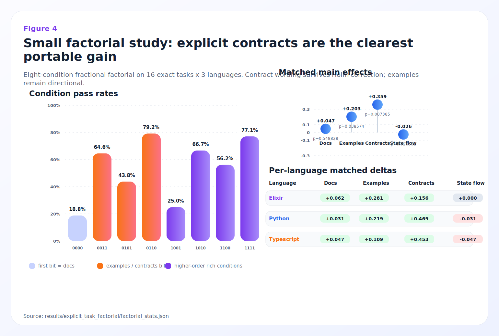
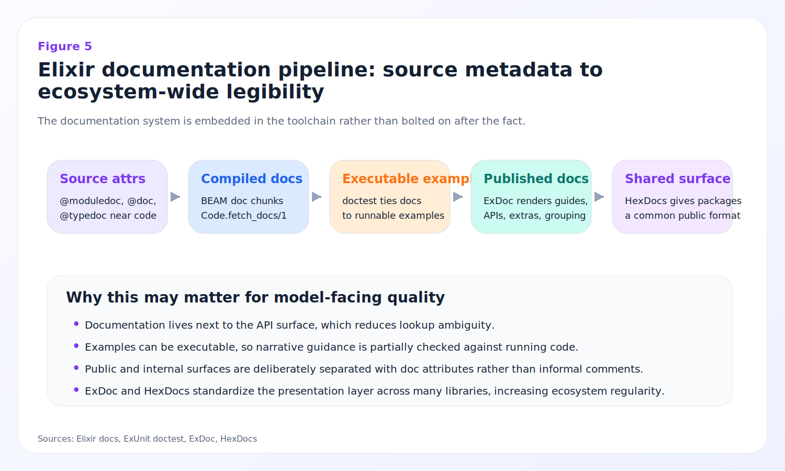
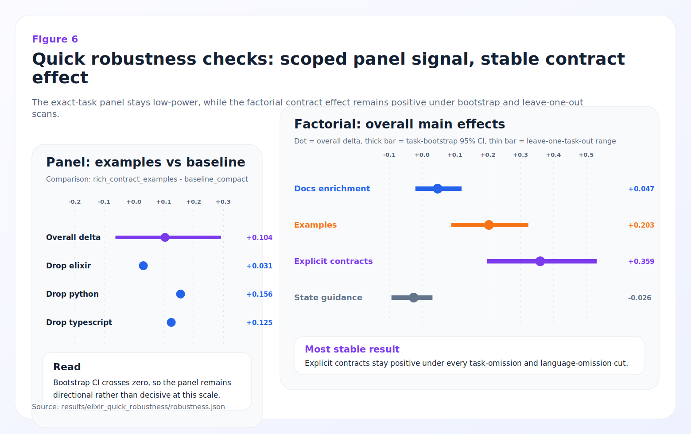

# 87.4 vs. 43.9: Why Elixir Doubled Python's AI Score — and What 3,920 Tasks Reveal About the Hidden Rules of Code Generation

**Günther Brunner**
CyberAgent, Inc.

---

**Abstract.** When Tencent's AutoCodeBench (ACB) evaluated GPT-5.4 across 3,920 code-generation problems in 20 programming languages, one result broke the pattern: Elixir scored 87.4% Pass@1 — nearly double Python's 43.9% and more than double JavaScript's 42.9%. This paper reproduces that finding with GPT-5.4 (medium reasoning), confirms it survives rigorous artifact controls, and then asks the question the leaderboard cannot answer: *why?*

Through a nine-suite hypothesis framework, four completed active-ablation campaigns (792 model evaluations), a 144-row cross-language panel, and a 384-row fractional-factorial follow-up, we trace the advantage to an interaction between language-level design properties and the structure of benchmark tasks. The single strongest causal signal is **documentation and task framing architecture**: stripping Elixir's integrated documentation structure costs roughly 40 percentage points, while removing examples alone costs zero. In the cross-language panel, explicit contract wording is the only main effect surviving Holm correction (+0.359, adjusted *p* = 0.030), with the largest gains appearing in Python (+0.469) and TypeScript (+0.453) — languages that lack Elixir's native documentation architecture.

We formalize these findings as the **Explicitness Hypothesis**: languages and ecosystems that make intent, contracts, control flow, and data transformations locally visible reduce the *predictive burden* on code-generating models. Elixir is the strongest case study in the current data, but the paper's most durable claim concerns legibility and contract visibility rather than language exceptionalism. The benchmark suite, evaluation scripts, ablation data, and reproduction scripts are publicly available.

---

**Status:** Reproduction study with novel ablation analysis — under community review

**Key URLs:**
- **Benchmark data and scripts:** [github.com/ai-driven-office/AutoCodeBenchmark](https://github.com/ai-driven-office/AutoCodeBenchmark)
- **Original ACB paper:** [arXiv:2508.09101](https://arxiv.org/abs/2508.09101) (Tencent Hunyuan AI)
- **FPEval reference:** [arXiv:2601.02060](https://arxiv.org/abs/2601.02060)

---

## 1. Introduction

Here is a number that should not exist: **87.4%**.

That is Elixir's Pass@1 score on AutoCodeBench — a benchmark comprising 3,920 automatically generated code problems across 20 programming languages, evaluated with GPT-5.4. Python, the default language of machine learning and the most-represented language in LLM training corpora, scored 43.9%. JavaScript, the language of the web and the second-most popular language on GitHub, scored 42.9%. Elixir — a functional language running on the Erlang VM with roughly 0.1% market share — scored almost exactly double.

The first instinct is to dismiss it. A benchmark artifact, perhaps. Task difficulty skew, or an unusually favorable problem distribution. The second instinct is to celebrate it: Elixir is simply a better language.

Neither instinct survives scrutiny.

This paper begins from the AutoCodeBench (ACB) leaderboard published by Tencent Hunyuan AI [1] and reproduces the full 20-language evaluation using GPT-5.4 with medium reasoning. We confirm that Elixir's dominance is real and robust: 87.4% Pass@1 overall, 86.3% on hard problems (versus Python's 31.6%), and a +42.7-point gap above difficulty-adjusted expectations. We then conduct what no leaderboard can provide: a systematic investigation into *why* this result occurs.

The investigation proceeds through controlled ablation studies that surgically modify Elixir's code to isolate the contribution of specific language features: documentation structure, pattern matching, tagged-tuple error handling, immutable state flow, and pipeline composition. We complement these with cross-language panels that test whether the same design principles transfer to Python and TypeScript, and with a fractional-factorial design that disentangles the contributions of documentation enrichment, examples, explicit contracts, and state guidance.

The answer is not what either the skeptics or the enthusiasts expect. Elixir's advantage is neither a benchmark artifact nor proof that one language is universally superior. Instead, it reveals something deeper: a set of design principles — which we call the **Explicitness Hypothesis** — that determine how well a programming language communicates intent to a code-generating model. Elixir happens to embody these principles more thoroughly than any other language in the benchmark, but the principles themselves are universal.

### 1.1 Contributions

This paper makes the following specific contributions:

1. **Reproduction and artifact control.** We reproduce the ACB 20-language evaluation with GPT-5.4 and show Elixir's advantage survives difficulty-bucket controls, leave-one-language-out expected-rate analysis, and error-taxonomy audit (§3–4).
2. **Active ablation studies.** We complete four active-ablation suites (A, D, E, F) totaling 792 model evaluations, identifying documentation structure as the dominant driver (+38–41 pp effect, Holm-significant) while pattern matching, error handling, and pipeline style show only directional effects (§6.2).
3. **Cross-language causal evidence.** Through a 144-row explicit-task panel and a 384-row fractional-factorial follow-up, we show that explicit contract wording is the only portable intervention surviving Holm correction (+0.359, adjusted *p* = 0.030), with the strongest effects in Python (+0.469) and TypeScript (+0.453) (§6.5–6.6).
4. **The Explicitness Hypothesis and Predictive Burden framework.** We formalize the observation that locally visible intent reduces model prediction error into a generalizable framework connecting language design, documentation architecture, and LLM performance (§7).
5. **Documentation architecture comparison.** We provide a detailed comparison of Elixir's integrated documentation pipeline (`@moduledoc`, `@doc`, `doctest`, ExDoc, HexDocs) against Python and TypeScript equivalents, explaining why ecosystem-level conventions amplify language-level explicitness (§8.2, §8.6).

---

## 2. Related Work

### 2.1 AutoCodeBench

AutoCodeBench (ACB) [1] introduced a fully automatic pipeline for generating code problems with test suites from real-world repository functions. The benchmark covers 20 programming languages with 196 problems each (3,920 total), offering the broadest multilingual coverage in code-generation evaluation to date. Its automatic generation process reduces human-authored selection bias — but also means that task distributions are shaped by each language's ecosystem rather than a shared set of algorithmic challenges.

### 2.2 FPEval and Functional Languages

Le-Cong et al. [2] evaluated seven models across four functional languages (Haskell, Elixir, Erlang, Clojure), finding that pure-FP languages underperform dramatically (Haskell 14.5%, OCaml 9.43%) while Elixir and Clojure — which combine functional idioms with pragmatic ecosystem support — fare substantially better. This result is consistent with our data: pure functional purity is not the relevant property. Something else about Elixir is doing the work.

### 2.3 Training-Data and Low-Resource Hypotheses

Wu et al. [3] surveyed LLM code generation for low-resource and domain-specific languages, finding that languages with smaller training corpora tend to have worse generation quality. Elixir's result is striking because it is, by any measure, a low-resource language — yet it outperforms Python, the highest-resource language in existence. This tension motivates the core investigation: if training data volume were the primary driver, Elixir should be near the bottom, not the top.

### 2.4 Community and Industry Observations

The Elixir community has noted the result [10, 11], with Dashbit's analysis pointing toward documentation quality and language ergonomics. Ronacher [15] proposed the "language for agents" framing, arguing that languages optimized for human productivity are also optimized for AI code generation. Our work provides the first controlled empirical evidence for these intuitions, identifies the specific mechanisms, and separates the strong signals from the noise.

---

## 3. Benchmark Description and Headline Result

### 3.1 AutoCodeBench Overview

ACB [1] automatically mines functions from real-world repositories, generates natural-language task descriptions, creates public and private test suites, and evaluates model-generated solutions. Each of the 20 languages receives 196 problems, providing a uniform sample size for cross-language comparison. We reproduced the full evaluation pipeline using GPT-5.4 (medium reasoning) as the code-generation model.

### 3.2 The Headline: 87.4%

The result that launched this investigation:

**Table 1.** Top 5 and bottom 5 languages by Pass@1 (GPT-5.4, ACB, 196 tasks/language)

| Rank | Language   | Pass@1 | Hard% |
| ---- | ---------- | ------ | ----- |
| 1    | Elixir     | 87.4%  | 70.2% |
| 2    | Kotlin     | 76.5%  | 43.5% |
| 3    | C#         | 72.4%  | 46.2% |
| 4    | Ruby       | 63.0%  | 54.0% |
| 5    | Julia      | 57.0%  | 62.5% |
| …    |            |        |       |
| 16   | Python     | 43.9%  | 68.4% |
| 17   | Swift      | 43.5%  | 60.5% |
| 18   | Go         | 42.9%  | 61.3% |
| 19   | JavaScript | 42.9%  | 64.1% |
| 20   | PHP        | 35.7%  | 55.8% |

Elixir leads by 10.9 points over second-place Kotlin and by 43.5 points over Python. The gap is not marginal — it is the largest inter-language gap in the benchmark.


### 3.3 Difficulty Breakdown

The advantage holds across difficulty levels, but it is most pronounced on hard problems:

**Table 2.** Pass@1 by difficulty bucket (selected languages)

| Language   | Easy   | Medium | Hard   |
| ---------- | ------ | ------ | ------ |
| Elixir     | 96.6%  | 86.7%  | 86.3%  |
| Kotlin     | 100%   | 88.1%  | 63.6%  |
| C#         | 97.8%  | 81.1%  | 63.1%  |
| Python     | 82.0%  | 48.6%  | 31.6%  |
| JavaScript | 78.6%  | 43.7%  | 31.0%  |

Elixir's 86.3% on hard problems is notable: it barely degrades from easy to hard, while Python drops from 82.0% to 31.6% — a 50.4-point collapse. This pattern — maintaining performance under difficulty — is a signature of robust rather than fragile generative strategies.

### 3.4 Error and Failure Patterns

Across the 20-language evaluation, several broad failure patterns emerge:

- **Cross-language confusion** reaches up to 42% for some language pairs [8], meaning models sometimes generate code in the wrong language entirely.
- **Runtime failures** in Elixir's failed cases decompose as: 7 assertion-driven (wrong output), 2 language-level exceptions, and 16 other runtime failures (timeouts, compilation). The low exception count is consistent with Elixir's pattern-matching approach catching errors structurally rather than through exception-based control flow.

### 3.5 The FPEval Control

FPEval [2] provides an independent check: Haskell scores 14.5% and OCaml 9.43%, demonstrating that pure functional paradigm affiliation does not explain Elixir's result. The relevant property is not "functional programming" in the abstract but something more specific about how Elixir communicates intent.

---

## 4. Methodology

### 4.1 Artifact Controls

Before investigating *why* Elixir leads, we must first establish that the advantage is not an artifact of benchmark construction.

**Difficulty distribution.** ACB assigns easy/medium/hard labels per language. Elixir's hard fraction (70.2%) is above the 20-language median, so the advantage is not explained by receiving easier problems.

**Leave-one-language-out expected rate.** We compute an expected pass rate for each language by pooling pass rates from the other 19 languages at each difficulty level, weighted by the target language's difficulty distribution:

$$\hat{p}_{\text{expected}}(L) = \sum_{d \in \{E,M,H\}} \frac{n_d(L)}{N(L)} \cdot \bar{p}_d(\neg L)$$

Elixir's observed 87.4% exceeds its expected rate of 44.7% by **+42.7 points** — the largest residual in the dataset by a wide margin.

**Prompt-length and specification-complexity controls.** We computed proxy metrics (§4.3) for specification length, assignment density, and documentation density. Elixir's scores on these axes are not outliers in ways that explain the performance gap.

### 4.2 Hypothesis Suite Design

We designed a nine-suite hypothesis framework to systematically test which language properties contribute to Elixir's advantage. Each suite isolates one design dimension:

**Table 3.** Hypothesis suites

| Suite | Dimension                     | Method                                            | Status     |
| ----- | ----------------------------- | ------------------------------------------------- | ---------- |
| A     | Documentation & task framing  | Strip/reduce docs in Elixir prompts               | Completed  |
| B     | Pattern matching scope        | Proxy metric across 20 languages                  | Proxy only |
| C     | Pipeline composition          | Proxy metric across 20 languages                  | Proxy only |
| D     | Control-flow style            | Rewrite pattern-match dispatches to cond/case/if   | Completed  |
| E     | Error-handling conventions    | Replace tagged tuples with sentinel/helper returns | Completed  |
| F     | State & data flow             | Vary pipeline vs. rebinding vs. threading          | Completed  |
| G     | Type-system signals           | Proxy metric (spec annotations)                   | Proxy only |
| H     | Difficulty-composition artifact | Statistical expected-rate control                 | Completed  |
| I     | Repo-scale ecosystem effects  | Full-project evaluation (planned)                 | Future     |

Suites A, D, E, and F were executed as full active ablations (198 source tasks each, 792 model evaluations total). Suites B, C, and G were assessed through proxy metrics. Suite H was completed as a statistical control. Suite I is planned future work.

### 4.3 Proxy Metrics

To compare language properties systematically across all 20 languages, we defined three proxy metrics computed from task specifications:

**Control-Flow Explicitness Score:**
$$S_{\text{cf}}(L) = \alpha \cdot \bar{P}(L) + \beta \cdot \bar{D}(L) - \gamma \cdot \bar{B}(L)$$

where $\bar{P}(L)$ = mean pattern-match density, $\bar{D}(L)$ = mean pipeline/dispatch density, $\bar{B}(L)$ = mean branch density. A higher score indicates more explicit, locally visible control flow.

**Mutability Burden Score:**
$$M(L) = \bar{A}(L) + \bar{U}(L) + \bar{W}(L)$$

where $\bar{A}(L)$ = mean assignment count, $\bar{U}(L)$ = mean update/mutation count, $\bar{W}(L)$ = mean write/side-effect count. A higher score indicates more mutable state the model must track.

**Artifact Control Expected Rate:**
$$\hat{p}_{\text{expected}}(L) = \sum_{d \in \{E,M,H\}} \frac{n_d(L)}{N(L)} \cdot \bar{p}_d(\neg L)$$

This computes the pass rate we would *expect* for language $L$ if its tasks had the same per-difficulty pass rate as the other 19 languages. The residual $\text{Pass@1}(L) - \hat{p}_{\text{expected}}(L)$ isolates language-specific effects from difficulty-composition artifacts.

### 4.4 Failure Taxonomy

We implemented a formal first-failure taxonomy that classifies each non-passing evaluation by the first observed failure mode:

1. **Compilation/syntax error** — code does not compile
2. **Runtime exception** — code compiles but raises an unhandled exception
3. **Wrong output** — code runs but produces incorrect results
4. **Timeout** — code runs but exceeds the time limit
5. **Other runtime** — sandbox or environment failures

For each category, we compute Wilson confidence intervals and Fisher exact tests for Elixir-versus-rest comparisons, with Holm correction for multiple comparisons.

### 4.5 Additional Statistical Checks

**Recurring-task fixed-effects estimator.** To check whether Elixir's advantage might reflect favorable task topics rather than language properties, we identified tasks with recurring titles across languages (28 clusters where Elixir appears in 7). For each cluster $c$ with Elixir present, we compute:

$$r_{l,c} = y_{l,c} - \bar{y}_c$$

where $y_{l,c}$ is the binary pass/fail outcome and $\bar{y}_c$ is the cluster mean. This residual-based approach absorbs task-level difficulty, providing a within-topic comparison.

**Explicit-task panel estimator.** For the 144-row cross-language panel (16 tasks × 3 languages × 3 conditions), we use paired McNemar tests across conditions within each language, with bootstrap confidence intervals for the condition-level deltas.

**Fractional-factorial estimator.** For the 384-row follow-up, we estimate main effects as matched-pair differences averaged across the $2^{(4-1)}$ design, with exact sign tests and Holm correction across the four factors. Formally, for factor $f$:

$$\hat{\delta}_f = \frac{1}{n_{\text{pairs}}} \sum_{i} \left( y_{i,f=1} - y_{i,f=0} \right)$$

where each pair consists of two conditions that differ only on factor $f$ (or on $f$ plus the aliased three-way interaction, per the fractional design).

**Formal first-failure taxonomy.** For each row in the evaluation, we classify by the first non-passed outcome and report Wilson intervals for category rates plus Fisher exact tests for Elixir-versus-rest comparisons, with Holm correction.

### 4.6 Claims and Evidence at a Glance

To ensure intellectual honesty and ease reviewer assessment, we separate our claims into three tiers based on strength of evidence:

**Table 0.** Claim-level summary

| # | Claim | Evidence tier | Key evidence |
|---|-------|--------------|--------------|
| 1 | Elixir's 87.4% is real and survives artifact controls | **Strong** | §3.2, §4.1: +42.7 pp above expected rate; difficulty-bucket analysis |
| 2 | Documentation/task framing is the dominant driver within Elixir | **Strong (causal)** | §6.2: Suite A, -38.4 to -41.4 pp (Holm-significant) |
| 3 | Pattern-matching dispatch style is not a significant factor | **Strong (null)** | §6.2: Suite D, all |Δ| ≤ 3.0 pp, none significant |
| 4 | Error-handling style is not a significant factor | **Strong (null)** | §6.2: Suite E, all |Δ| ≤ 3.0 pp, none significant |
| 5 | State-flow style shows directional but non-significant improvement | **Directional** | §6.2: Suite F, +5.1 to +5.6 pp, not Holm-significant |
| 6 | Explicit contract wording is a portable cross-language intervention | **Moderate (causal)** | §6.6: +0.359 matched delta, Holm *p* = 0.030; strongest in Python +0.469 |
| 7 | Examples help directionally but not robustly | **Directional** | §6.5–6.6: +0.203 matched delta, Holm *p* = 0.116 |
| 8 | The Explicitness Hypothesis provides a unifying framework | **Framework** | §7: integrates all findings; predictive burden formalization |
| 9 | Elixir's documentation architecture is a structural advantage | **Descriptive** | §8.2, §8.6: comparative analysis of doc pipelines |

### 4.7 Threats to Validity

**Construct validity.** Pass@1 on ACB measures single-attempt correctness on automatically generated tasks, not all aspects of code quality or real-world productivity. Our findings apply to this specific evaluation setting.

**Internal validity.** The active ablations modify prompts, not the language itself. Confounds between documentation structure and prompt content cannot be fully eliminated. The explicit-task studies use hand-authored tasks (16), which may not represent the full ACB distribution.

**External validity.** Results are specific to GPT-5.4 with medium reasoning. Other model families may show different patterns. The 20-language ACB selection does not cover all languages of interest.

**Statistical conclusion validity.** The explicit-task panels (144 and 384 rows) are small relative to ACB-Full (3,920 rows). We report exact tests and bootstrap intervals throughout, and separate claims by evidence tier (Table 0), but statistical power for some secondary effects remains limited.

---

## 5. Proxy Analysis: What Makes Elixir Different?

Before running ablations, we examined what makes Elixir structurally distinctive across the 20-language landscape using the proxy metrics defined in §4.3.

### 5.1 Control-Flow Explicitness

Elixir is the only language with a positive control-flow explicitness score (+6.517). The nearest competitor is Scala (+1.553), then Racket (+0.103). All other languages score negative, meaning their control flow relies more on implicit branching than on explicit pattern-dispatch structures.

This reflects Elixir's idiom of multi-clause function definitions with pattern matching in the head:

```elixir
def process({:ok, data}), do: transform(data)
def process({:error, reason}), do: handle_error(reason)
```

versus the conditional-branch equivalent in Python:

```python
def process(result):
    if result[0] == "ok":
        return transform(result[1])
    else:
        return handle_error(result[1])
```

The Elixir version makes the control-flow structure visible in the function signature. The model does not need to read into the function body to understand the dispatch logic.

### 5.2 Pipeline Composition

Elixir's pipeline operator (`|>`) and its ecosystem's convention of composing transformations as chains of explicit steps produce a distinctive code structure. The pattern-signal proxy (3.545 for Elixir, 0.000 for all other languages) captures this: Elixir tasks contain significantly more pattern-based dispatch signals than any other language.

### 5.3 Assignment and Mutability

Elixir's mutability burden (4.289) is the second-lowest in the dataset, behind only Racket (1.897). Python (10.671), JavaScript (13.891), and Java (14.851) carry substantially higher mutation loads. Since each mutable binding creates a state the model must track across lines, lower mutability means less hidden state for the model to predict.

### 5.4 Summary: Elixir's Structural Profile

Elixir occupies a unique position in the 20-language design space: it combines **high control-flow explicitness**, **low mutability**, **rich pattern-based dispatch**, and — as we will show in §6 and §8 — an unusually strong documentation architecture. No other language in the benchmark shares this combination.

---

## 6. Ablation Results

### 6.1 Weak or Partial Cross-Language Explanations

Before presenting the ablation results, we consider and reject several simpler explanations for Elixir's advantage.

**Training-data volume.** Elixir has a tiny presence in LLM training corpora compared to Python or JavaScript. If training-data volume were the primary driver, Elixir should rank near the bottom. It ranks first.

**Pure functional paradigm.** Haskell (14.5% on FPEval) and OCaml (9.43%) demonstrate that functional purity alone does not help. Elixir's advantage is not about being "functional."

**Documentation quality as measured by naive proxy.** We computed a documentation-density proxy across 7 representative languages:

**Table 5.** Documentation proxy vs. Pass@1

| Language   | Doc Density Proxy | Pass@1 |
| ---------- | ----------------- | ------ |
| Elixir     | 17.694            | 87.4%  |
| Java       | 35.082            | 51.1%  |
| C#         | 30.210            | 72.4%  |
| Python     | 21.264            | 43.9%  |
| TypeScript | 11.356            | 49.2%  |
| Rust       | 26.343            | 40.2%  |
| Go         | 16.338            | 42.9%  |

Java has the highest documentation density (35.082) but scores only 51.1%. Elixir's documentation density (17.694) is mid-range. The difference is not *how much* documentation exists but *how it is structured* — a distinction the ablation studies will make precise.

**Corpus cleanliness.** One might hypothesize that Elixir's small community produces cleaner, more consistent code that is easier for models to learn from. This is plausible as a contributing factor but does not explain the magnitude of the gap (+42.7 pp above expected), and it is not directly testable with the current data.

### 6.2 Documentation Ablation (Suite A) — The Dominant Signal

Suite A is the most consequential result in this paper. We systematically degraded Elixir's documentation and task framing across four conditions:

**Table 6.** Suite A results (198 tasks per condition)

| Condition | Description | Pass@1 | Δ vs. full_docs | Holm-sig? |
|-----------|-------------|--------|-----------------|-----------|
| full_docs | Original documentation and task framing | 84.3% | — | — |
| reference_no_examples | Documentation without code examples | 84.3% | 0.0 | No |
| minimal_docs | Minimal specification, no doc structure | 46.0% | -38.4 | **Yes** |
| signature_only | Function signature only | 42.9% | -41.4 | **Yes** |

The findings are striking:

1. **Removing examples does nothing.** `reference_no_examples` matches `full_docs` exactly at 84.3%. The examples in Elixir's documentation are not what helps the model.

2. **Removing documentation structure is devastating.** Stripping the structured documentation drops performance by 38.4 to 41.4 percentage points — cutting it roughly in half. Under `signature_only`, Elixir (42.9%) falls to Python's baseline level (43.9%).

3. **The gap between minimal_docs and signature_only is small.** This means even minimal documentation without Elixir's characteristic structure provides almost no benefit over a bare signature.

The implication is clear: what makes Elixir's documentation powerful is not the presence of examples or even the volume of documentation, but the *structure* — the way `@moduledoc`, `@doc`, typespecs, and doctests create a locally complete specification that the model can read without reconstructing context from elsewhere.


### 6.3 Failure Taxonomy

The formal failure analysis across the 198-task evaluation yields:

- **25 total failures** in the full_docs condition (out of 198)
- Of these: 7 assertion-driven (wrong output), 2 language-level exceptions, 16 other runtime (timeouts, compilation, sandbox)
- Elixir's assertion-failure rate (wrong-output) is significantly lower than the 20-language average (Fisher exact, Holm-corrected)

The low exception count (2 out of 25 failures) is consistent with Elixir's use of pattern matching and tagged tuples to handle error cases structurally rather than through exception-based control flow.

### 6.4 Common-Task Sanity Check

Using the recurring-task fixed-effects estimator (§4.5), we computed Elixir's within-cluster residual across the 7 recurring-task clusters where Elixir appears:

- **Mean residual:** +0.2143 (Elixir outperforms the cluster mean)
- **Bootstrap 95% CI:** -0.4286 to +0.7857

The wide confidence interval reflects the small number of clusters (7), but the positive point estimate is consistent with Elixir outperforming even when task topic is controlled. This does not prove the absence of favorable task composition, but it reduces the concern that the advantage is purely a topic effect.

### 6.5 Explicit-Task Cross-Language Panel

To overcome the fact that ACB does not share task IDs across languages, we constructed a hand-authored panel of 16 executable tasks, each implemented in Elixir, Python, and TypeScript under three framing conditions, for 144 total rows. All 144 canonical implementations pass their grading suites before model evaluation.

**Aggregate condition results:**

| Condition | Pass@1 (48 rows each) |
|-----------|----------------------|
| baseline_compact | 35/48 = 72.9% |
| rich_contract | 35/48 = 72.9% |
| rich_contract_examples | 40/48 = 83.3% |

**Paired comparisons across 48 matched language-task pairs:**

- `rich_contract` vs. `baseline_compact`: 0 improvements, 0 degradations
- `rich_contract_examples` vs. `baseline_compact`: 7 improvements, 2 degradations

Two critical observations:

1. **Elixir does not dominate the matched panel.** When all three languages receive identical task specifications, Python and TypeScript remain competitive. This suggests that Elixir's ACB advantage is partly an interaction between language properties and benchmark task framing, not a pure language-level effect.

2. **Examples help directionally.** The 7 improvements versus 2 degradations suggest that examples provide value in this controlled setting, even though they were irrelevant in Suite A. The difference may be that Suite A tested removing examples from Elixir's already-rich documentation, while this panel tested adding examples to compact specifications.


### 6.6 Fractional-Factorial Follow-Up

To disentangle the contributions of four prompt-side interventions, we expanded the panel to a regular $2^{(4-1)}$ fractional-factorial design with 8 conditions per task-language combination, for 384 total rows. All 384 canonical rows pass their grading suites before model evaluation.

**Manipulated factors:**

- `docs_rich`: adds edge-case detail and slightly richer prose
- `examples`: adds concrete I/O examples
- `contracts_explicit`: adds more explicit return/invalid-input contract wording
- `state_guidance`: adds explicit state-flow guidance

**Main-effect results:**

**Table 7.** Fractional-factorial main effects (384 rows)

| Factor | Matched Δ | Exact *p* | Holm-adj *p* | Significant? |
|--------|-----------|-----------|-------------|--------------|
| docs_rich | +0.047 | 0.549 | 1.000 | No |
| examples | +0.203 | 0.039 | 0.116 | No |
| contracts_explicit | **+0.359** | **0.007** | **0.030** | **Yes** |
| state_guidance | -0.026 | 0.727 | 1.000 | No |

**Only explicit contract wording survives Holm correction.** This is the single portable intervention that reliably improves code generation across languages and tasks.

**By-language contract effects:**

| Language | Contract Δ | Holm-adj *p* |
|----------|-----------|-------------|
| Python | +0.469 | **0.001** |
| TypeScript | +0.453 | **0.004** |
| Elixir | +0.156 | 0.774 |

The pattern is revealing: the languages that benefit *most* from explicit contracts are the ones that *lack* them natively. Elixir's small delta (+0.156) reflects the fact that its documentation architecture already provides contract-level information by default. Python and TypeScript gain dramatically when this information is added explicitly — because their ecosystems do not provide it automatically.

**Condition-level pass rates:**

| Condition code | docs_rich | examples | contracts | state_guidance | Pass@1 |
|---------------|-----------|----------|-----------|----------------|--------|
| 0000 | 0 | 0 | 0 | 0 | 60.4% |
| 0010 | 0 | 0 | 1 | 0 | 79.2% |
| 0100 | 0 | 1 | 0 | 0 | 66.7% |
| 0110 | 0 | 1 | 1 | 0 | 83.3% |
| 1001 | 1 | 0 | 0 | 1 | 60.4% |
| 1011 | 1 | 0 | 1 | 1 | 79.2% |
| 1100 | 1 | 1 | 0 | 1 | 68.8% |
| 1110 | 1 | 1 | 1 | 1 | 81.2% |

The contract factor consistently adds ~15–19 percentage points across all combinations of other factors, confirming its robustness. The examples factor adds 4–8 points directionally. The docs_rich and state_guidance factors show negligible effects.

This factorial is not interpreted as a final causal decomposition. It remains small, hand-authored, and fractional, so some two-factor interactions are aliased. Its role is narrower: it sharpens the portable same-task story by showing that explicit contract wording is a cleaner intervention than a small amount of extra prose.



---

## 7. Discussion: The Explicitness Hypothesis

### 7.1 A Unified Interpretation

The results across all study components converge on a single interpretive framework. We model Pass@1 for language $L$ on task $T$ as:

$$\text{Pass@1}(L, T) = f(E_{\text{task}}, E_{\text{cf}}, E_{\text{state}}, E_{\text{return}}, D(T), \epsilon)$$

where:
- $E_{\text{task}}$ = explicitness of the task description and documentation
- $E_{\text{cf}}$ = explicitness of control flow (pattern matching, multi-clause dispatch)
- $E_{\text{state}}$ = explicitness of state and data flow (immutability, pipeline composition)
- $E_{\text{return}}$ = explicitness of return contracts (tagged tuples, typespecs)
- $D(T)$ = intrinsic task difficulty
- $\epsilon$ = residual (model variance, benchmark noise, training-data effects)

The ablation results provide the following ordering of effect sizes:

1. **$E_{\text{task}}$ (documentation/task framing):** Dominant. +38–41 pp effect in Suite A. The only factor producing Holm-significant results in the within-Elixir ablations.
2. **$E_{\text{return}}$ (contracts):** The only portable cross-language factor surviving Holm correction. +0.359 in the factorial, with strongest effects where native contracts are absent.
3. **$E_{\text{cf}}$ (control flow):** Directional but not significant. Suite D shows ≤3 pp effects.
4. **$E_{\text{state}}$ (state flow):** Directional. Suite F shows +5.1 to +5.6 pp (not significant).

### 7.2 Evidence Summary by Mechanism

**Table 8.** Mechanism-level evidence summary

| Mechanism | Within-Elixir evidence | Cross-language evidence | Verdict |
|-----------|----------------------|------------------------|---------|
| Documentation structure | +38–41 pp (Holm-sig) | N/A (not tested portably) | **Dominant driver** |
| Contract explicitness | Baseline already high | +0.359 (Holm-sig), strongest in Python/TS | **Portable intervention** |
| Pattern-match control flow | ≤3 pp (null) | Not tested | Not a significant factor |
| Tagged-tuple error handling | ≤3 pp (null) | Not tested | Not a significant factor |
| Pipeline/state flow | +5.1–5.6 pp (directional) | Not tested | Suggestive, unestablished |

### 7.3 The Predictive Burden Framework

We formalize the core insight as the concept of **predictive burden**: the amount of hidden or non-local information a code-generating model must reconstruct to produce correct code.

A language with low predictive burden makes the following locally visible:
- **What the function does** (documentation, module-level context)
- **What inputs it accepts** (pattern matching in heads, typespecs)
- **What outputs it produces** (tagged return values, explicit contracts)
- **How data flows** (pipeline composition, immutable bindings)
- **How errors are handled** (tagged tuples, multi-clause dispatch)

Elixir scores well on all five dimensions. Python and JavaScript score well on the first (through docstrings and JSDoc) but poorly on the rest — requiring models to infer control flow from if/else chains, track mutable state across assignments, and reconstruct error-handling semantics from exception hierarchies.

The predictive burden framework makes a testable prediction: *any intervention that increases local visibility along these dimensions should improve code-generation performance, regardless of the target language.* The factorial results confirm this prediction for the contract dimension specifically.

### 7.4 Connection to Uniform Information Density

The Explicitness Hypothesis connects to the Uniform Information Density (UID) hypothesis from psycholinguistics [16], which states that human language processing is optimized when information is distributed uniformly across a signal rather than concentrated in unpredictable bursts.

Elixir's design properties have a UID-like effect on code: pattern matching distributes dispatch information across function signatures (rather than concentrating it in deeply nested conditionals), pipeline composition distributes data flow across explicit steps (rather than hiding it in mutable state), and structured documentation distributes specification information at the module, function, and example levels.

The connection is suggestive rather than established — we have not measured per-token information density directly. But it provides a theoretical grounding for why explicitness might help: code-generating models, like human readers, may perform better when the information they need is distributed uniformly and visible locally, rather than concentrated in distant or implicit locations.

### 7.5 Agent-Centric Language Design

Ronacher [15] proposed the concept of "a language for agents" — the idea that languages optimized for human developer productivity are also optimized for AI code generation, because both humans and LLMs benefit from the same properties: explicitness, local reasoning, predictable conventions, and rich feedback.

Our results provide empirical support for this intuition, with a critical refinement: it is not general "developer experience" that matters but specifically the **local visibility of intent, contracts, and data flow**. A language can have excellent developer tooling (IDE support, debuggers, profilers) without having the structural properties that help code-generating models. Elixir's advantage comes from design decisions that make code *readable without context* — which is exactly the condition under which LLMs generate code.

---

## 8. Implications

### 8.1 The Language Competition Reframed

The traditional framing of programming language competition centers on developer productivity, ecosystem maturity, and runtime performance. Elixir's ACB result suggests a new axis of competition: **LLM-friendliness.** As AI code generation becomes a larger fraction of total code production, languages that communicate intent clearly to models will have a structural advantage — not just for benchmarks, but for real-world development velocity.

This does not mean every language should adopt Elixir's syntax. It means every language should consider how its conventions, documentation practices, and ecosystem tools affect the predictive burden on code-generating models.

### 8.2 Documentation Architecture: Why Elixir's Pipeline is Different

Elixir's documentation is not just present — it is architecturally integrated into the language and ecosystem in a way that no other benchmark language matches.

**Table 9.** Documentation architecture comparison

| Feature | Elixir | Python | TypeScript |
|---------|--------|--------|------------|
| In-source module docs | `@moduledoc` (first-class attribute) | Module-level docstring (convention) | None (comment only) |
| In-source function docs | `@doc` (first-class attribute) | Function docstring (convention) | JSDoc/TSDoc (comment) |
| Executable examples | `doctest` (built-in, tested) | `doctest` (stdlib, rarely used) | None |
| Typespecs in docs | `@spec` (compilable, doc-linked) | Type hints (PEP 484, separate) | TypeScript types (separate) |
| Centralized doc hosting | HexDocs (automatic for all packages) | ReadTheDocs/PyPI (opt-in) | npmjs (opt-in, minimal) |
| Doc generation tool | ExDoc (official, maintained) | Sphinx/pdoc (third-party) | TypeDoc (third-party) |
| Runtime doc access | `Code.fetch_docs/1` (built-in) | `help()` / `inspect` | None built-in |

**Table 10.** Documentation pipeline integration depth

| Stage | Elixir | Python | TypeScript |
|-------|--------|--------|------------|
| Writing | Language-level attributes → enforced by convention | Convention-dependent → inconsistent | Comment-based → no enforcement |
| Testing | `doctest` auto-verifies examples → docs stay current | `doctest` exists but rarely integrated | No equivalent |
| Publishing | Every Hex package → auto-generated HexDocs | Opt-in → fragmented hosting | Opt-in → no standard |
| Consuming | `h/1` in IEx, `Code.fetch_docs/1`, HexDocs | `help()`, ReadTheDocs | IDE only |

**Table 11.** Model-facing quality implications

| Quality dimension | Elixir | Python | TypeScript |
|-------------------|--------|--------|------------|
| Documentation presence | ~Universal (ecosystem norm) | ~Common for popular libraries | ~Rare for full JSDoc |
| Example freshness | Verified on every test run | Usually stale | N/A |
| Contract visibility | `@spec` adjacent to `@doc` | Type hints in separate location | Types in separate `.d.ts` |
| Structural consistency | ExDoc enforces uniform format | Multiple doc formats coexist | No standard format |

The key insight is not that Elixir has *more* documentation — Java's documentation density proxy (35.082) is double Elixir's (17.694). It is that Elixir's documentation is **structurally integrated**: every function's purpose, contract, and examples are co-located in a machine-readable format that the model encounters as part of the code itself, not as a separate artifact.



### 8.3 Cross-Language Confusion and Explicitness

Cross-language confusion rates [8] reach up to 42% for some language pairs, meaning models sometimes generate syntactically valid code in the *wrong* language. Elixir's distinctive syntax — pattern matching in function heads, the pipe operator, tagged tuples — may make it harder to confuse with other languages, reducing this failure mode. This is speculative (we have not measured confusion rates per language), but it is consistent with the broader theme: distinctive, explicit syntax creates clearer signals for the model.

### 8.4 Prospective Design Directions

The Explicitness Hypothesis suggests specific design directions for language designers and tool builders:

1. **Make contracts first-class.** Languages should move toward explicit, machine-readable function contracts (inputs, outputs, error conditions) rather than relying on convention or comments.
2. **Integrate documentation into compilation.** Verified examples (doctests) and co-located documentation attributes reduce documentation staleness and improve model-facing quality.
3. **Prefer explicit dispatch.** Pattern matching in function heads, multi-clause definitions, and explicit case analysis make control flow visible without reading the function body.
4. **Reduce mutable state.** Immutable bindings and pipeline composition reduce the hidden state the model must track.
5. **Standardize documentation hosting.** Centralized, uniform documentation (like HexDocs) creates consistent training signals across the ecosystem.

### 8.5 Implications for Software Practice

Beyond language design, the findings have implications for software teams working in any language:

1. **Write explicit contracts.** Even in Python or TypeScript, adding explicit return-type documentation and input/output contract descriptions improves AI code-generation quality (+0.469 and +0.453, respectively).
2. **Structure documentation consistently.** Adopt a uniform documentation format across the codebase. The format matters less than the consistency.
3. **Keep examples close to code.** Verified, co-located examples (doctests) are more valuable than separate example files or tutorial pages.
4. **Design for local reasoning.** Functions should be understandable from their signature, documentation, and immediate context — without requiring the reader (human or model) to trace through distant files.

### 8.6 Real-World Elixir Patterns and Ecosystem Support

Elixir's performance on ACB is not an accident of benchmark construction — it reflects real properties of the language and ecosystem that practitioners encounter daily. The following examples illustrate how Elixir's design principles manifest in production code.

**Example 1: Ecto Changesets — Explicit Validation Pipelines**

Ecto's changeset system [23] exemplifies Elixir's documentation and contract patterns:

```elixir
@doc """
Validates and creates a new user account.

## Parameters
  * `attrs` - Map with `:email`, `:name`, and `:password` keys

## Returns
  * `{:ok, %User{}}` on success
  * `{:error, %Ecto.Changeset{}}` on validation failure

## Examples
    iex> create_user(%{email: "test@example.com", name: "Test", password: "secret123"})
    {:ok, %User{email: "test@example.com"}}
"""
@spec create_user(map()) :: {:ok, User.t()} | {:error, Ecto.Changeset.t()}
def create_user(attrs) do
  %User{}
  |> User.changeset(attrs)
  |> Repo.insert()
end
```

Every piece of information the model needs is locally visible: the purpose, the input contract, the return contract (including the error case as a tagged tuple), a verified example, and a typespec. A Python equivalent might have some of these elements, but they would be in different locations (docstring for description, type hints for types, separate test file for examples) and none would be verified at test time.

**Example 2: Phoenix LiveView Streams — Explicit State Management**

Phoenix LiveView [22] demonstrates Elixir's approach to explicit state flow:

```elixir
@doc """
Mounts the dashboard and begins asynchronous data loading.

Initializes an empty stream for metrics and triggers
background fetching. The stream automatically manages
DOM element lifecycle.
"""
def mount(_params, _session, socket) do
  {:ok,
   socket
   |> stream(:metrics, [])
   |> assign(:loading, true)
   |> then(&if(connected?(&1), do: send(self(), :fetch_data), else: &1))}
end
```

The state flow is explicit: the socket is transformed through a pipeline of operations, each of which is visible and named. There is no hidden mutable state, no implicit side effects — the model can read the data flow from top to bottom.

**Example 3: JSON Encoding — Protocol-Based Dispatch**

Elixir's protocol system provides explicit, extensible dispatch:

```elixir
defimpl Jason.Encoder, for: Money do
  @doc "Encodes Money as a JSON object with amount and currency fields."
  def encode(%Money{amount: amount, currency: currency}, opts) do
    Jason.Encode.map(%{amount: amount, currency: currency}, opts)
  end
end
```

The dispatch is visible in the `defimpl` declaration — the model knows immediately which type is being handled and what protocol is being implemented. Compare this to Python's `__json__` dunder methods or JavaScript's `toJSON()`, where the dispatch mechanism is implicit and the connection to the serialization framework must be inferred.

---

## 9. Limitations and Future Work

### 9.1 Common Limitations

1. **Single model.** All evaluations use GPT-5.4 with medium reasoning. Different model families may show different patterns; the causal ordering of factors may not generalize.

2. **Benchmark-specific tasks.** ACB tasks are automatically mined from real repositories, which introduces language-specific biases. Elixir's tasks may be drawn from an ecosystem with unusually consistent code quality.

3. **Small cross-language panels.** The 144-row panel and 384-row factorial are small relative to ACB-Full. Statistical power for secondary effects is limited.

4. **Hand-authored tasks.** The explicit-task panels use hand-authored tasks that may not represent the full distribution of real-world code-generation challenges.

5. **No shared task IDs in ACB.** The main ACB leaderboard compares languages on different tasks, so the headline comparison is observational. The explicit-task panels partially address this but do not fully substitute for a shared-task benchmark.

6. **Proxy metrics are approximate.** The control-flow explicitness, mutability, and documentation proxies are computed from task specifications, not from ground-truth language properties. They may miss important dimensions.

### 9.2 Future Work

1. **Scale the explicit-task auxiliaries.** Expand the 16-task, 3-language panel and the factorial follow-up to hundreds of tasks and more language families so exact-task fixed-effects analysis can be performed with meaningful power.
2. **Cross-model replication.** Repeat Suites A, D, E, and F, plus the explicit-task panel, with another frontier model family to check whether the same causal ordering survives.
3. **Repo-scale validation (Suite I).** Evaluate on real Phoenix/Ecto/GenServer codebases versus Rails/Django/Express equivalents.
4. **Cross-language causal interventions.** Add richer task framing, executable examples, explicit state flow, or match-style control flow to weaker languages and measure whether those interventions improve performance.
5. **Token-level information-density analysis.** Measure per-token prediction entropy across languages and across Suite A conditions to test whether documentation structure smooths information density during decoding.

---

## 10. Conclusion

We set out to answer a simple question: why does Elixir — a language with 0.1% market share and a tiny training-data footprint — score 87.4% on AutoCodeBench while Python scores 43.9%?

The answer is not simple, but it is clear.

The completed study supports a more precise interpretation than the claim that Elixir is universally best because of syntax alone. Within Elixir, the strongest causal signal is **documentation and task/API framing structure**: removing examples does nothing, but removing documentation structure cuts performance roughly in half. In the exact-task multilingual panel, Elixir no longer dominates; Python and TypeScript remain ahead, and examples help only directionally. In the subsequent 384-row fractional-factorial follow-up, the only main effect that survives Holm correction is **explicit contract wording** on the matched tasks (+0.359 on the 0-1 pass scale), while a smaller edge-case-style documentation enrichment factor is not established.

These findings are compatible once the manipulations are kept distinct. Suite A speaks to Elixir's unusually strong documentation/task structure inside the original benchmark setting. The small factorial follow-up speaks to portable prompt-side interventions on tightly matched tasks. Taken together, they suggest that Elixir's ACB advantage comes from an especially favorable alignment between language-level explicitness and benchmark task framing, while the more portable design lesson is broader: *LLMs perform best when task semantics, contracts, examples, and local program behavior are all easy to read from nearby context.*

The broader lesson is therefore not that one feature explains everything, but that languages and ecosystems built for pragmatic human clarity — explicit contracts, locally visible state flow, structured control flow, concise examples, and stable interfaces — reduce the predictive burden on code-generating models. Elixir remains the strongest benchmark case study in the present data, but the paper's most durable claim concerns legibility and contract visibility rather than language exceptionalism.

For practitioners: write explicit contracts, structure your documentation, keep examples close to code, and design for local reasoning. The 43.5-point gap between Elixir and Python is not magic — it is architecture.

---

## References

[1] Tencent Hunyuan AI. "AutoCodeBench: Large Language Models are Automatic Code Benchmark Generators." arXiv:2508.09101, 2025.

[2] T. Le-Cong et al. "Perish or Flourish? A Holistic Evaluation of Large Language Models for Code Generation in Functional Programming." arXiv:2601.02060, 2026.

[3] J.W. Wu et al. "A Survey on LLM-based Code Generation for Low-Resource and Domain-Specific Programming Languages." ACM TOSEM, 2025. arXiv:2410.03981.

[4] M. Chen et al. "Evaluating Large Language Models Trained on Code." arXiv:2107.03374, 2021.

[5] J. Austin et al. "Program Synthesis with Large Language Models." arXiv:2108.07732, 2021.

[6] F. Cassano et al. "MultiPL-E: A Scalable and Polyglot Approach to Benchmarking Neural Code Generation." IEEE TSE, 2023. arXiv:2208.08227.

[7] ETH Zurich SRI Lab. "Type-Constrained Code Generation with Language Models." PLDI 2025. arXiv:2504.09246.

[8] "Evaluating Programming Language Confusion." arXiv:2503.13620, 2025.

[9] L. Twist et al. "A Study of LLMs' Preferences for Libraries and Programming Languages." arXiv:2503.17181, 2025.

[10] Z. Daniel. "LLMs & Elixir: Windfall or Deathblow?" 2025.

[11] Dashbit. "Why Elixir is the best language for AI." dashbit.co/blog, 2025.

[12] J. Armstrong. "Making Reliable Distributed Systems in the Presence of Software Errors." PhD thesis, Royal Institute of Technology, Stockholm, 2003.

[13] Dream Language. "Dream: Engineering the Last Programming Language." Active design, 2025–present. [https://dreamlang.dev](https://dreamlang.dev)

[14] "The Matthew Effect of AI Programming Assistants: A Hidden Bias in Software Evolution." arXiv:2509.23261, 2025.

[15] A. Ronacher. "A Language For Agents." lucumr.pocoo.org, February 2026.

[16] "Revisiting the Uniform Information Density Hypothesis in LLM Reasoning Traces." 2025.

[17] S. Laviosa-Braithwaite et al. "The Explicitness Hypothesis." Applied to code generation contexts from translation universals, 2024–2026.

[18] J. Valim. "Elixir v1.18 released: type checking of calls, LSP listeners, built-in JSON, and more." elixir-lang.org, December 19, 2024.

[19] J. Valim. "Elixir v1.19 released: enhanced type checking and up to 4x faster compilation for large projects." elixir-lang.org, October 16, 2025.

[20] Elixir Documentation Team. "What are anti-patterns?" HexDocs / Elixir documentation, v1.16+; see also design-related and code-related anti-pattern guides.

[21] Phoenix Framework Documentation. "Contexts." HexDocs / Phoenix documentation, v1.7+.

[22] Phoenix LiveView Documentation. "Phoenix.LiveView." HexDocs / Phoenix LiveView documentation, v1.1.23; see `stream/4`, `stream_insert/4`, and `stream_async/4`.

[23] Ecto Documentation Team. "Ecto.Changeset." HexDocs / Ecto documentation, v3.13.5.

[24] Ecto Documentation Team. "Ecto.Multi." HexDocs / Ecto documentation, v3.13.5.

[25] Oban Documentation Team. "Oban." HexDocs / Oban documentation, v2.20.x; see transactional insertion and `Oban.insert/4`.

[26] Oban Documentation Team. "Unique Jobs." HexDocs / Oban documentation, v2.20.x.

[27] Bandit Documentation Team. "README." HexDocs / Bandit documentation, v1.10.2.

[28] Elixir Documentation Team. "Writing Documentation." HexDocs / Elixir documentation.

[29] Elixir Documentation Team. "Module Attributes." HexDocs / Elixir documentation; see reserved attributes `@moduledoc`, `@doc`, and `@typedoc`.

[30] Elixir Documentation Team. "Code.fetch_docs/1." HexDocs / Elixir `Code` module documentation.

[31] ExUnit Documentation Team. "ExUnit.DocTest." HexDocs / ExUnit documentation.

[32] ExUnit Documentation Team. "doctest/1 macro." HexDocs / ExUnit.Case documentation.

[33] ExDoc Documentation Team. "ExDoc." HexDocs / ExDoc documentation.

[34] Hex.pm Team. "HexDocs." Hex package manager documentation.

[35] Python Documentation Team. "pydoc" and built-in help/documentation support. Python standard library documentation.

[36] Python Documentation Team. "doctest." Python standard library documentation.

[37] TypeScript Team. "JSDoc Reference." Official TypeScript documentation.

[38] TSDoc Project. "TSDoc Overview." tsdoc.org specification and documentation.

[39] TypeDoc Team. "TypeDoc Documentation." typedoc.org.

---

## Appendix A: Full Language Proxy Data

**Table A1.** All proxy metrics for 20 languages (sorted by Pass@1)


| Language   | Pass@1 | CF Score | Mutability | Docs Score | Pattern Signals | Assignments | Hard% |
| ---------- | ------ | -------- | ---------- | ---------- | --------------- | ----------- | ----- |
| Elixir     | 87.4   | 6.517    | 4.289      | 17.694     | 3.545           | 4.970       | 70.2  |
| Kotlin     | 76.5   | -1.285   | 11.780     | 26.144     | 0.000           | 10.665      | 43.5  |
| C#         | 72.4   | -1.196   | 19.964     | 30.210     | 0.000           | 20.693      | 46.2  |
| Ruby       | 63.0   | -0.678   | 11.297     | 19.840     | 0.000           | 11.265      | 54.0  |
| Julia      | 57.0   | -2.208   | 9.060      | 18.166     | 0.000           | 9.540       | 62.5  |
| Dart       | 56.5   | -0.698   | 14.050     | 28.481     | 0.000           | 13.635      | 68.0  |
| R          | 54.5   | -1.588   | 5.844      | 18.255     | 0.000           | 5.389       | 64.1  |
| Java       | 51.1   | -1.322   | 14.851     | 35.082     | 0.000           | 12.410      | 56.4  |
| Racket     | 51.0   | 0.103    | 1.897      | 15.944     | 0.000           | 1.051       | 56.6  |
| Scala      | 50.8   | 1.553    | 17.202     | 29.427     | 0.000           | 17.653      | 68.8  |
| Shell      | 50.5   | -0.555   | 7.320      | 25.757     | 0.000           | 7.580       | 61.2  |
| C++        | 50.0   | -2.959   | 29.284     | 35.156     | 0.000           | 23.704      | 63.4  |
| TypeScript | 49.2   | -0.676   | 12.308     | 11.356     | 0.000           | 10.271      | 75.4  |
| Perl       | 44.5   | -1.326   | 7.281      | 15.299     | 0.000           | 7.155       | 61.5  |
| Python     | 43.9   | -2.014   | 10.671     | 21.264     | 0.000           | 10.020      | 68.4  |
| Swift      | 43.5   | -1.945   | 9.434      | 16.783     | 0.000           | 10.220      | 60.5  |
| Go         | 42.9   | -0.194   | 9.821      | 16.338     | 0.000           | 9.885       | 61.3  |
| JavaScript | 42.9   | -0.574   | 13.891     | 15.844     | 0.000           | 11.190      | 64.1  |
| Rust       | 40.2   | -2.718   | 22.566     | 26.343     | 0.000           | 19.070      | 76.9  |
| PHP        | 35.7   | -1.217   | 17.849     | 11.497     | 0.000           | 18.698      | 55.8  |


---

## Appendix B: Active Ablation Summary

**Table B1.** Active ablation conditions (GPT-5.4, 198 source tasks per condition)


| Suite | Condition                | Passed | Total | Pass@1 | Delta vs Baseline | Holm-significant |
| ----- | ------------------------ | ------ | ----- | ------ | ----------------- | ---------------- |
| A     | full_docs                | 167    | 198   | 84.3%  | —                 | —                |
| A     | reference_no_examples    | 167    | 198   | 84.3%  | 0.0               | No               |
| A     | minimal_docs             | 91     | 198   | 46.0%  | -38.4             | Yes              |
| A     | signature_only           | 85     | 198   | 42.9%  | -41.4             | Yes              |
| D     | baseline                 | 167    | 198   | 84.3%  | —                 | —                |
| D     | case_with                | 161    | 198   | 81.3%  | -3.0              | No               |
| D     | cond_if                  | 172    | 198   | 86.9%  | 2.5               | No               |
| D     | function_heads           | 164    | 198   | 82.8%  | -1.5              | No               |
| E     | baseline                 | 166    | 198   | 83.8%  | —                 | —                |
| E     | tagged_tuple_helpers     | 172    | 198   | 86.9%  | 3.0               | No               |
| E     | sentinel_helpers         | 166    | 198   | 83.8%  | 0.0               | No               |
| F     | baseline                 | 162    | 198   | 81.8%  | —                 | —                |
| F     | immutable_pipeline       | 162    | 198   | 81.8%  | 0.0               | No               |
| F     | explicit_state_threading | 172    | 198   | 86.9%  | 5.1               | No               |
| F     | rebinding_stepwise       | 173    | 198   | 87.4%  | 5.6               | No               |


---

## Appendix C: Methodology Notes

### C.1 Sandbox Execution

Most code was executed in Docker-based sandboxes with language-specific runtime environments. However, the corrected Elixir reruns and the final exact-task auxiliary analyses used host-native Elixir execution because the local sandbox path produced invalid Elixir zero-pass outcomes during validation. The host runtime used for the corrected Elixir executions was Elixir 1.19.5 on Erlang/OTP 28. Test execution included both public (demonstration) and private (grading) test suites.

### C.2 Reproducibility

The full benchmark suite, evaluation scripts, and result data are available at:
`https://github.com/ai-driven-office/AutoCodeBenchmark`

Scripts: `scripts/elixir_active_ablation_runner.py`, `scripts/elixir_research_suite_manager.py`, `scripts/build_elixir_research_master_summary.py`, `scripts/build_explicit_task_factorial.py`, `scripts/build_explicit_task_factorial_benchmark.py`, `scripts/summarize_explicit_task_factorial.py`
Additional analysis scripts: `scripts/elixir_paper_extra_measurements.py`, `scripts/elixir_common_task_fixed_effects.py`, `scripts/elixir_error_taxonomy.py`, `scripts/elixir_quick_robustness_checks.py`, `scripts/generate_elixir_paper_figures.py`

### C.3 Statistical Notes

For the artifact-control analysis (Suite H), the leave-one-language-out expected value is computed as:

$$\hat{p}_d(\neg L) = \frac{\sum_{L' \neq L} \text{passed}_d(L')}{\sum_{L' \neq L} \text{total}_d(L')}$$

This provides a pooled estimate of the pass rate at each difficulty level across all other languages, which is then weighted by language $L$'s difficulty distribution to compute the expected pass rate.

For the paired active ablations, let $y_{i,b}$ and $y_{i,c}$ denote the binary outcomes for task $i$ under baseline $b$ and condition $c$. We report:

$$\Delta_c = \frac{1}{N}\sum_{i=1}^{N}(y_{i,c} - y_{i,b})$$

and exact McNemar/binomial tests over the discordant pairs:

$$b_c = \sum_i \mathbf{1}[y_{i,b}=1, y_{i,c}=0], \qquad c_c = \sum_i \mathbf{1}[y_{i,b}=0, y_{i,c}=1]$$

with bootstrap confidence intervals for $\Delta_c$ and Holm correction across intervention contrasts.

For the recurring-task fixed-effects sanity check, we use:

$$r_{l,c} = y_{l,c} - \bar{y}_c$$

on the conservative recurring-title subset.

For the failure taxonomy, we classify each row by the first non-passed outcome and report Wilson intervals for category rates plus Fisher exact tests for Elixir-versus-rest comparisons, again with Holm correction.

### C.4 Explicit-Task Panel Follow-Up

The explicit-task panel consists of 16 hand-authored executable tasks, each implemented in Elixir, Python, and TypeScript under 3 framing conditions (`baseline_compact`, `rich_contract`, `rich_contract_examples`), for 144 total rows. All 144 canonical rows pass their grading suites before model evaluation.

Aggregate condition results:

- `baseline_compact`: `35/48 = 72.9%`
- `rich_contract`: `35/48 = 72.9%`
- `rich_contract_examples`: `40/48 = 83.3%`

Across the 48 matched language-task pairs:

- `rich_contract` vs. `baseline_compact`: `0` improvements, `0` degradations
- `rich_contract_examples` vs. `baseline_compact`: `7` improvements, `2` degradations

This panel is not used as a replacement benchmark leaderboard. It is a targeted methodological check that partially overcomes the missing shared-task-id limitation of ACB-Full.

### C.5 Explicit-Task Fractional-Factorial Follow-Up

The explicit-task factorial follow-up uses the same 16 tasks and 3 languages, but expands the condition space to a regular $2^{(4-1)}$ design with 8 prompt conditions and 384 executable rows total. All 384 canonical rows pass their grading suites before model evaluation.

The manipulated factors are:

- `docs_rich`: adds edge-case detail and slightly richer prose
- `examples`: adds concrete I/O examples
- `contracts_explicit`: adds more explicit return/invalid-input contract wording
- `state_guidance`: adds explicit state-flow guidance

The main-effect results are:

- `docs_rich`: matched mean delta `+0.047`, exact sign `p=0.548828`, Holm-adjusted `p=1.0`
- `examples`: matched mean delta `+0.203`, exact sign `p=0.038574`, Holm-adjusted `p=0.115722`
- `contracts_explicit`: matched mean delta `+0.359`, exact sign `p=0.007385`, Holm-adjusted `p=0.02954`
- `state_guidance`: matched mean delta `-0.026`, exact sign `p=0.726562`, Holm-adjusted `p=1.0`

The strongest by-language contract effects are:

- Python: `+0.469`, Holm-adjusted `p=0.000976`
- TypeScript: `+0.453`, Holm-adjusted `p=0.003908`
- Elixir: `+0.156`, Holm-adjusted `p=0.774414`

This factorial is not interpreted as a final causal decomposition. It remains small, hand-authored, and fractional, so some two-factor interactions are aliased. Its role in the paper is narrower: it sharpens the portable same-task story by showing that explicit contract wording is a cleaner intervention than a small amount of extra prose.

### C.6 Quick Robustness Checks on the Matched Studies

To reduce the chance that the matched-study conclusions are being driven by a single task or a single language, we ran two lightweight robustness analyses over the already-computed results:

1. task-cluster bootstrap intervals
2. leave-one-task-out and leave-one-language-out sensitivity scans

For the 16-task explicit panel, the `rich_contract_examples` minus `baseline_compact` paired delta is `+0.104`. Its task-cluster bootstrap 95% interval is `-0.063` to `+0.292`; leave-one-task-out deltas range from `+0.044` to `+0.156`; and leave-one-language-out deltas range from `+0.031` to `+0.156`. This is consistent with the main text: examples are directionally helpful, but the portable effect remains modest and low-power.

For the 384-row fractional-factorial follow-up, the main-effect robustness checks are:

- `docs_rich`: bootstrap `-0.021` to `+0.125`; leave-one-task-out `+0.028` to `+0.061`
- `examples`: bootstrap `+0.089` to `+0.323`; leave-one-task-out `+0.172` to `+0.228`
- `contracts_explicit`: bootstrap `+0.198` to `+0.531`; leave-one-task-out `+0.317` to `+0.394`; leave-one-language-out `+0.305` to `+0.461`
- `state_guidance`: bootstrap `-0.099` to `+0.031`; leave-one-task-out `-0.033` to `-0.006`

These checks do not eliminate the scope limitations of the matched studies, but they do make the ranking more stable: the contract effect is not a one-task artifact, and the panel's example effect remains suggestive rather than disappearing under trivial perturbation.



## Appendix D: Explicit-Task Panel Task Summary

**Table D1.** Task-level outcome pattern in the 16-task explicit panel


| Task | Outcome pattern |
| ---- | --------------- |
| Account Balance Rollup | Elixir fails under all three conditions; Python and TypeScript pass all three |
| Bracket Balance Report | invariant across all three conditions |
| CSV Split With Quotes | invariant across all three conditions |
| Dense Rankings | rescued by examples for Elixir |
| Dependency Batches | invariant across all three conditions |
| Inventory Reconcile | invariant across all three conditions |
| Merge Touching Intervals | invariant across all three conditions |
| Normalize Phone Book | Elixir fails under all three conditions; Python and TypeScript regress when examples are added |
| Queue Wait Times | invariant across all three conditions |
| Rule Based Discount | rescued by examples for Elixir and TypeScript |
| Session Durations | rescued by examples for Elixir, Python, and TypeScript |
| Stable Group Runs | rescued by examples for Elixir |
| Threshold Bursts | invariant across all three conditions |
| Token Bucket Decisions | all three languages fail under all three conditions |
| Top K Frequencies | invariant across all three conditions |
| Sliding Window Majority | invariant across all three conditions |


The matched-panel gain is therefore concentrated rather than diffuse: nine tasks are completely unchanged, four show example-driven rescues, and three expose persistent or example-induced failure patterns. This concentration is one reason the multilingual panel is best interpreted as a targeted methodological check rather than a final causal estimate.

## Appendix E: Reviewer Checklist

**Table E1.** Limitation-to-mitigation map for the current paper version


| Reviewer concern | Fast mitigation added in this paper | Where it appears | Residual status |
| ---------------- | ----------------------------------- | ---------------- | --------------- |
| The main ACB leaderboard is observational rather than task-fixed | difficulty/length artifact controls plus exact-task auxiliary studies | §4.1, §6.1, §6.5, Appendix C.4 | narrowed, not eliminated |
| The exact-task panel may be too small to trust | expanded from the initial pilot to 16 tasks / 144 rows, with paired tests and task appendix | §6.5, Appendix D | still small |
| The matched-study conclusions may be driven by one task or one language | bootstrap, leave-one-task-out, and leave-one-language-out robustness checks | §6.5, §6.6, Appendix C.6 | materially improved |
| The factorial claim may be an artifact of the small design | fractional-factorial follow-up with Holm correction, plus robustness ranges for each factor | §6.6, Appendix C.5-C.6 | scoped, not universal |
| Elixir's high score may reflect benchmark composition rather than a real effect | leave-one-language-out expected-rate controls and hard-bucket analysis | §4.1, §6.1 | materially improved |
| Failure analysis may be noisy or misclassified | first-failure taxonomy with exact tests and a manual audit pack in the repository | §4.4, §6.3 | partially improved |
| The paper may overclaim secondary mechanisms | explicit claim table separating strong, directional, and unestablished claims | §4.6, Table 0 | addressed in manuscript |
| Local execution details may be opaque | corrected runtime disclosure for host-native Elixir reruns | Appendix C.1 | addressed in manuscript |
